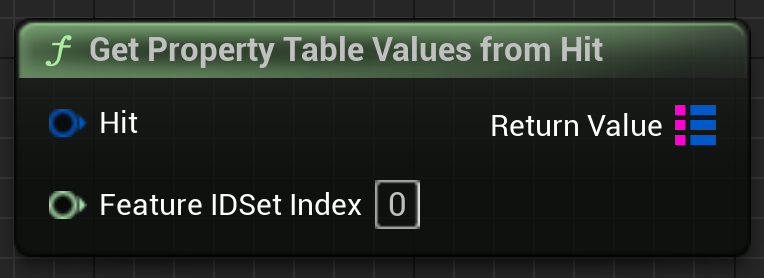

# API Design Guide

Cesium for Unreal unlocks geospatial capabilities in Unreal Engine while also enabling developers to take advantage of in-engine features. As a result, people who use the plugin can often come with existing Unreal knowledge.

In order to make Cesium's integration as seamless as possible, we aim to mirror the paradigms and APIs of the engine where we can. This guide provides best practices for how we do that.

## Table of Contents

- [UObject Design](#uobject-design)
  - [Overview](#overview)
  - [Best Practices](#best-practices)
  - [Quick Reference](#quick-reference)
- [Blueprints](#blueprints)
- [Deprecation and Backwards Compatibility](#deprecation-and-backwards-compatibility)

## UObject Design

`UObject` is the underlying base class of gameplay objects in Unreal Engine. Most classes in the Cesium for Unreal plugin inherit from `UObject`, such that they expose their functionality to the systems in Unreal Engine.

The [Overview](#overview) points out some of the components involved when designing `UObject`s. If you are already familiar with these, feel free to skip to the [Best Practices](#best-practices) section.

### Overview

#### `UObject`

> [Official Unreal Engine Documentation](https://dev.epicgames.com/documentation/en-us/unreal-engine/objects-in-unreal-engine)

The official documentation already contains a summary of `UObject`, so we won't duplicate that here. However, we build on a few elements in [UObject Creation](https://dev.epicgames.com/documentation/en-us/unreal-engine/objects-in-unreal-engine#uobjectcreation) and [Destroying Objects](https://dev.epicgames.com/documentation/en-us/unreal-engine/objects-in-unreal-engine#destroyingobjects) below.

- `UObject`s may only use default constructors. In other words, a `UObject` cannot have a constructor with arguments.
- The documentation says to use the `BeginPlay` method for specific initialization behavior. But most of our objects need to work in the Editor as well, where `BeginPlay` isn't called. We rely on a variety of other methods, like `OnConstruction`, `PostLoad`, `Serialize`, etc. to manage various aspects of the initialization. See [Initialization](#initialization) for more detail.
- `UObject`s are automatically garbage collected when they are no longer referenced. Therefore, be mindful of "strong references" that can keep them alive (e.g., UProperties, class instances, `TStrongObjectPtr`).
  - A regular pointer to a `UObject` will become invalid after it's garbage collected, and dereferencing the pointer will lead to undefined behavior.

#### Properties

> [Official Unreal Engine Documentation](https://dev.epicgames.com/documentation/en-us/unreal-engine/unreal-engine-uproperties)

`UObject`s often contain member variables (or properties) important to the object's gameplay logic. However, beyond declaring the property in C++, you need an extra step to Unreal Engine recognize (and later manipulate) those variables.

The `UPROPERTY` macro identifies such properties. This macro should be put above a property that you wish to expose to Unreal Engine. Once recognized, the properties can be acted upon, e.g., made accessible through Blueprints or the Editor UI. It may also be used to enable event handlers and delegates.

#### Functions

> [Official Unreal Engine Documentation](https://dev.epicgames.com/documentation/en-us/unreal-engine/ufunctions-in-unreal-engine)

`UFUNCTION` is the equivalent of `UPROPERTY` for C++ functions. By using this macro, a function can be made accessible to Blueprints, or even as a button in the Editor interface.

#### Structs

> [Official Unreal Engine Documentation](https://dev.epicgames.com/documentation/en-us/unreal-engine/structs-in-unreal-engine)

`USTRUCT` is the macro to expose `struct`s to Unreal Engine. They are fairly straightforward, but a few elements of note are:

- `USTRUCT`s don't inherit from `UObject`, so they are not managed by the Garbage Collection system.
- `USTRUCT`s can contain `UPROPERTY`s, and `UObject`s can also have `USTRUCT` type properties.
- `USTRUCT`s can be used in Blueprints depending on their specifiers.
   - `USTRUCT(BlueprintType)` enables the `Make` node (to create the struct).
   - For properties to appear in the `Break` node (for retrieval), they must have either `BlueprintReadOnly` or `BlueprintReadWrite` specifiers. See [Specifiers](#specifiers) below.

#### Enums

`UENUM` is used for any enum classes that Unreal should use in a `UObject` context, e.g., as a type for `UPROPERTY` or Blueprints. `UENUM` should be used on an `enum class` of `uint8`; it typically does not work on pure `enum`s.

```cpp
UENUM()
enum class EMyEnum : uint8
{
  ...
};
```

#### Specifiers

Many `UObject` macros take arguments that influence their scope and behavior. The [Quick Reference](#quick-reference) is included so you can focus on the most relevant ones.

For example, check out the `MaximumScreenSpaceError` property on `ACesium3DTileset`:

```cpp
  UPROPERTY(
      EditAnywhere,
      BlueprintGetter = GetMaximumScreenSpaceError,
      BlueprintSetter = SetMaximumScreenSpaceError,
      Category = "Cesium|Level of Detail",
      meta = (ClampMin = 0.0))
  double MaximumScreenSpaceError = 16.0;
  ```

- The `EditAnywhere` specifier allows the property to appear and be modifiable by the user in the Details panel of the Editor.
- The `BlueprintGetter` and `BlueprintSetter` define specific functions for getting and setting the value in Blueprints (see [UFunctions](#ufunctions)).
- The `Category` indicates how the property should be organized in the Details panel. It appears under the "Level of Detail" category, which itself is nested in the "Cesium" category.
- Finally, `meta` refers to additional metadata that augments how the property functions or appears. Here, `ClampMin` prevents the Details UI from setting it to smaller values. (It may still be set through C++ or Blueprints.)

The official documentation for `UPROPERTY` explains the fundamentals, but it is not comprehensive. This [masterlist](https://benui.ca/unreal/uproperty/) of `UPROPERTY` specifiers by ben ui provides a more extensive look into what's possible. 

The `UFUNCTION` macro also takes multiple arguments to influence its behavior. 
For instance,

```cpp
  UFUNCTION(
      BlueprintPure,
      Category = "Cesium",
      meta = (ReturnDisplayName = "UnrealPosition"))
  FVector TransformLongitudeLatitudeHeightPositionToUnreal(
      const FVector& LongitudeLatitudeHeight) const;
```

- The `BlueprintPure` specifier allows the function to be executed in a Blueprint graph. The `Pure` keyword indicates that the function will not affect the owning object (`ACesiumGeoreference`) in any way.
- The `Category` indicates how the property should be organized in Blueprint selection panel, under "Cesium" category.
- Finally, `meta` refers to additional metadata that augments how the property functions or appears. Here, `ReturnDisplayName` specifies how the output will be labeled in the Blueprint node.

`UFUNCTION` must be used for any functions that are used for `BlueprintGetter` or `BlueprintSetter`. For `BlueprintSetter`, the function should be `public` and serve as the mechanism for setting the property from C++. A corresponding `BlueprintGetter` is usually needed for use by C++, even though it is often not needed for Blueprints.

Again, the official documentation for `UFUNCTION` explains the fundamentals, but this [masterlist](https://benui.ca/unreal/uproperty/) of `UFUNCTION` specifiers by ben ui is more extensive. 

### Best Practices

The following sections describe some best practices for designing `UObjects` in Cesium for Unreal.

#### Initialization

Most classes in Cesium for Unreal must work in Unreal Editor as well as Play Mode. But between the two modes, there are different methods that affect an object during its creation and loading process. We rely on a variety of methods to properly initialize the `UObject`, listed below.

| Name | What |
| ---- | ---- |
| `PostLoad` | Called in both the Editor and during gameplay for actors that are already placed in a level. This is **not** called for newly spawned actors at runtime. |
| `OnConstruction` | Called whenever objects are placed in the Editor or spawned during gameplay. May also be triggered after Blueprints are changed. |
| `Serialize` | Called when the object is serialized during project load or save. |
| `PostInitProperties` | Called after the C++ constructor of the `UObject` and after its properties have been initialized. |
| `BeginPlay` | Called at the start of Play Mode. |

In other words,

- Use`PostLoad` to initialize existing objects, and `OnConstruction` for newly-created ones.
- Use `Serialize` for scenarios like [Deprecation and Backwards Compatibility](#deprecation-and-backwards-compatibility).
- Use `BeginPlay` for exclusively runtime behavior.

`PostInitProperties` is not used often in Cesium for Unreal. When it *has* been used, it was to intercept the object immediately after default construction in C++ to transfer specific settings. But this is a rare case.

#### Change Detection

Many Cesium for Unreal classes manage an internal state that must be carefully maintained when modifying properties. For instance, when properties on the `ACesiumGeoreference` are changed, it must call `UpdateGeoreference()` immediately after to ensure that all other properties are synced in response.

As a result, `BlueprintReadWrite` is rarely used for properties in Cesium for Unreal. Much of the time, there is additional logic needed after a property is "set", so the change needs to be specifically detected.

We have settled on the following standards for properties that require post-change logic:

1. Declare properties as `private` in the class. This prevents the property from being get or set directly from outside the class in C++ (which is important, because there is no mechanism like `PostEditChangeProperty` or `BlueprintSetter` available in code).
2. Add `Meta = (AllowPrivateAccess)` to the `UPROPERTY`.
3. Add `BlueprintGetter` and `BlueprintSetter` functions.
4. Override the `PostEditChangeProperty` method on the class. This allows it to be notified of changes to the property in the Editor.

If a `UPROPERTY` is a `struct` type, then you may also need to override `PostEditChangeChainProperty`. This method works on chains of property changes—e.g., when a property inside the `struct` is changed. 

Finally, beware of any consequences from users undoing modifications on a `UObject`, or even copy-pasting it. These changes can be handled by `PostEditUndo` and `PostEditImport` respectively.

#### Conditional Properties

In Cesium for Unreal, many `UObject`s have properties that depend on each other to enable behaviors. For instance, a property may only be enabled if some other boolean property is true, or if an enum property is set to a certain value.

`Cesium3DTileset` is a great example for these conditional properties. The enum `Source` property affects whether the `URL` property can be edited. The boolean `Enable Culled Screen Space Error` property activates `Culled Screen Space Error` accordingly.

| Example | Inactive | Active |
| ------- | -------- | ------ |
| Enum |  |  |
| Boolean |  |  |

You can use the `meta = (EditCondition = "")` specifier to implement these conditions. Make sure that conditional properties are listed _below_ the properties that they depend on, both in C++ code and in the Details panel. This reinforces that logic and results in visual clarity.

```cpp
  UPROPERTY(EditAnywhere)
  bool EnableRandomness;

  UPROPERTY(
      EditAnywhere,
      meta = (EditCondition = "EnableRandomness"))
  int RandomSeed = 0;
```

The `EditCondition` is able to parse complex boolean logic, but it currently cannot reference functions.

```cpp
public:
  UPROPERTY()
  EDataType Type;

  UFUNCTION()
  bool IsNumber(EDataType Type) {
    return Type == EDataType::Int || Type == EDataType::Float || Type == EDataType::Double;
  }
  
  // This won't work...
  UPROPERTY(
    meta= (EditCondition = "IsNumber(Type)"))
  double Offset = 0.0;

  // ...so the check must be done manually.
  UPROPERTY(
    meta= (EditCondition = "Type == EDataType::Int || Type == EDataType::Float || Type == EDataType::Double"))
  double Offset = 0.0;
```

It can only parse `UPROPERTY` values, too, so don't reference any variables that aren't made accessible to Unreal Engine.

> There exists another specifier, `EditConditionHides`, that hides the property from the Details panel instead of making it read-only (visible but greyed out). However, Cesium for Unreal prefers to simply show the properties as read-only. 

#### Organization

Properties should be organized or modified in the Details panel such that they provide an intuitive user experience. Are the properties ordered in a logical manner? Is it clear which properties depend on each other?

Aside from implementing clear [Conditional Properties](#conditional-properties), be diligent about organizing properties in reasonable groups using the `Category` specifier. In fact, failing to give a category to public properties can cause a failure at packaging time!

Most classes, properties, and functions in Cesium for Unreal are put under a broad `Cesium` category. But there are typically subcategories that should be accounted for, too. This can be achieved by using the `|` delimiter in the category name.

```cpp
// Falls under the general "Cesium" category.
 UFUNCTION(Category = "Cesium")
 void RefreshTileset();

 // Nested under "Cesium" > "Debug".
 UPROPERTY(Category = "Cesium|Debug")
 bool SuspendUpdate;
 ```

This categorization will apply to Blueprints as well. Use categories to make the scopes of functions obvious from a glance. For example, it is easy to find which functions are relevant to `CesiumEllipsoid` due to their category:


Properties under the same category should also be adjacent in C++ to reinforce the logical grouping. For example, don't interleave categories like this in C++ code:

```cpp
  UPROPERTY(EditAnywhere, BlueprintReadWrite, Category = "Cesium|Debug")
  bool SuspendUpdate;

  UPROPERTY(EditAnywhere, Category = "Cesium|Tile Loading")
  bool PreloadAncestors;

  UPROPERTY(EditAnywhere, Category = "Cesium|Debug")
  bool UpdateInEditor;
```

Group them together:

```cpp
  UPROPERTY(EditAnywhere, BlueprintReadWrite, Category = "Cesium|Debug")
  bool SuspendUpdate;

  UPROPERTY(EditAnywhere, Category = "Cesium|Debug")
  bool UpdateInEditor;

  UPROPERTY(EditAnywhere, Category = "Cesium|Tile Loading")
  bool PreloadAncestors;
```

Additionally, keep in mind the order in which properties will appear. A good principle is to start with properties that are more simple or fundamental to the `UObject`. They can cascade into the more advanced settings further down the Details panel. For instance, this is the order of properties as they appear in `CesiumGeoreference.h`:

```cpp
  // This determines whether latitude / longitude / height are even used, so it appears first.
  UPROPERTY()
  EOriginPlacement OriginPlacement = EOriginPlacement::CartographicOrigin;
  
  UPROPERTY()
  double OriginLatitude;

  UPROPERTY()
  double OriginLongitude;
  
  UPROPERTY()
  double OriginHeight;

  // Users are less likely to modify the scale of the georeference, so it appears near the end.
  UPROPERTY()
  double Scale = 100.0;
```

Sometimes Unreal will position certain properties out-of-order, e.g., listing `UObject`-pointer properties below everything else. You can use `meta = (DisplayAfter = "")` or `meta = (DisplayPriority = 0)` specifiers to control the order in which properties appear. (Examples can be found [here](https://benui.ca/unreal/uproperty/#displayafter).)

You can also use the `AdvancedDisplay` specifier to explicitly delegate properties to the "Advanced" section of a category.


### Quick Reference

For convenience, here is a cheat sheet of some of the most relevant and/or helpful specifiers for use in Cesium for Unreal's development.

#### Blueprints

##### `UPROPERTY`

| Name | What | When to Use |
| ---- | ----- | --------------- |
| `BlueprintReadOnly` | Property is accessible in Blueprints but read-only. | Self-explanatory. | 
| `BlueprintReadWrite` | Property is editable from Blueprints. | When the "set" logic is simple enough that nothing additional must happen after the property is set. If additional logic is required, use `BlueprintSetter` instead. |
| `BlueprintGetter=[FunctionName]` | Property uses the specified function to get the value. | Whenever you have to use `BlueprintSetter`. | 
| `BlueprintSetter=[FunctionName]` | Property uses the specified function to set the value. | Whenever you have to do additional work after setting a property, e.g., recomputing the object's internal state. |
| `BlueprintAssignable` | For delegate or event properties, allows the property to be assigned in Blueprints. | Self-explanatory. |

##### `UFUNCTION`

| Name | What | When to Use |
| ---- | ----- | --------------- |
| `BlueprintCallable` | Function can be executed in a Blueprint or Level Blueprint graph. | For functions that depend on a sequence of node execution. For example, `UCesiumEllipsoid::Create` requires that the ellipsoid be created before something is done on it.<br><br>`BlueprintCallable` results in an "execution pin" to indicate what happens after the Blueprint moves on. For `const` functions, no execution pin will be generated, similar to `BlueprintPure`. |
| `BlueprintPure` | Function can be executed in a Blueprint or Level Blueprint graph without an execution pin. | For functions whose execution does not require explicit sequencing logic, and for which it will not affect the owning object. For example, `UCesiumEllipsoid::ScaleToGeodeticSurface` will implicitly execute before its value is used, and it does not change the `UCesiumEllipsoid` itself, so it can be a "pure" function. |
| `BlueprintGetter` | Function can be used as a `BlueprintGetter` for a `UPROPERTY`. | Can replace `BlueprintCallable`, if desired, to signal its use in `BlueprintGetter` for a `UPROPERTY`. |
| `BlueprintSetter` | Function can be used as a `BlueprintSetter` for a `UPROPERTY`. | Can replace `BlueprintCallable`, if desired, to signal its use in `BlueprintSetter` for a `UPROPERTY`. |
| `BlueprintNativeEvent` | For functions that are designed to be overridden by a Blueprint, this indicates that there is a default native implementation. The implementation function must be named `[OriginalFunctionName]_Implementation`. | For achieving behavior in Blueprints similar to virtual functions. Not used often by the plugin. |
| `meta = (ReturnDisplayName = "")` | Function output on the Blueprint node will be labeled with the specified name. | Good in general for visual clarity. |

#### Details Panel

##### `UPROPERTY`

| Name | What | When to Use |
| ---- | ----- | --------------- |
| `VisibleAnywhere` | Property is read-only in the Details panel. | For read-only variables. Don't use this for variables that shouldn't be visible to the user (e.g., implementation details, internal state management). |
| `EditAnywhere` | Property is editable in the Details panel. | For properties that should be user-editable through the Editor UI. |
| `AdvancedDisplay` | Property is separated into a dropdown "advanced" section that is hidden by default. | For advanced or complex properties that won't realistically be used by most users, e.g., `ACesium3DTileset::CesiumIonServer`. This prevents beginners from being confused, while still allowing advanced users to access that functionality. |
| `meta = (DisplayName = "")` | Property name is changed to `DisplayName` in the Details Panel (as well as its corresponding Blueprint). | Can be used to shorten property names or reword them for clarity. |
| `meta = (DisplayAfter = "")` | Property will be displayed below the `DisplayAfter` property in the Details Panel. | See [Organization](#organization). |
| `meta = (DisplayPriority = 0)` | Property will be assigned and sorted by numeric priority in the Details Panel. | See [Organization](#organization). |
| `meta = (EditCondition = "")` | Property is read-only if `EditCondition` is not met. | See [Conditional Properties](#conditional-properties). |
| `meta = (ClampMin = 0)` | Property is clamped to the minimum value or higher when edited in the Details panel. | To avoid invalid numeric values, e.g., an `OriginLatitude` below -90 degrees. |
| `meta = (ClampMax = 0)` | Property is clamped to the maximum value or lower when edited in the Details panel. | To avoid invalid numeric values, e.g., an `OriginLatitude` above 90 degrees. |
| `meta = (ShowOnlyInnerProperties)` | For `struct` properties, display their properties without nesting them in an expandable dropdown. | Use sparingly. This can help reduce visual clutter, e.g., to remove a level from multiple nested dropdowns. However, don't use this when the `struct`'s name is important for clarity. |
| `meta = (ValidEnumValues="A, B")` | Property is restricted to the enum values listed in the string. | Useful for limiting which values are acceptable for property. Avoids having to create duplicate enums or handle special cases. |
| `meta = (InvalidEnumValues="A, B")` | Property is disallowed from being the enum values listed in the string. | When using the above is too tedious. |

##### `UFUNCTION`

| Name | What | When to Use |
| ---- | ----- | --------------- |
| `CallInEditor` | Function can be executed using a button in the Details panel. | Any helpful in-editor functionality that a user can easily access, e.g., `RefreshTileset`. Note that the function must have _no parameters_ and _no return value_. |

#### Miscellaneous

##### `UPROPERTY`

| Name | What | When to Use |
| ---- | ----- | --------------- |
| `Category = ""` | Property will appear under the given category in the Details panel. | Required on all public `UPROPERTY`s. |
| `Transient` | Property is not serialized when the `UObject` is saved. | For anything that shouldn't be saved, e.g., temporary references to objects at runtime. |
| `meta = (AllowPrivateAccess)` | Property that is `private` in C++ can be accessed in Blueprints. | Use in accordance with the practices under [Change Detection](#change-detection). |
| `meta = (DeprecatedProperty) ` | Property is marked as deprecated. | See [Deprecation and Backwards Compatibility](#deprecation-and-backwards-compatibility). |

##### `UFUNCTION`

| Name | What | When to Use |
| ---- | ----- | --------------- |
| `meta = (DeprecatedFunction)` | Function is marked as deprecated. | See [Deprecation and Backwards Compatibility](#deprecation-and-backwards-compatibility). |

## Blueprints 

Blueprints are a visual scripting option in Unreal Engine that users may use over C++ code. Part of the API design in Cesium for Unreal therefore includes creating sensible Blueprints for less code-savvy users.

First, defer to Unreal Engine's naming schemes for existing Blueprint functions and parameters. For example, texture coordinates in Blueprints are often referred to as "UV". Cesium for Unreal tries to match this by naming its own texture coordinate parameters as "UV".


Ideally, the language between our Blueprints and those of Unreal Engine should be well integrated, and users should not feel like they have to "translate" ideas between different Blueprints.

Additionally, parameters should be listed in order of from most to least important, or from most to least essential. This means that when you write the function in C++, the first parameters should be the most fundamental or necessary ones. The more advanced parameters can come after. For example:

```cpp
TMap<FString, FCesiumMetadataValue> GetPropertyTableValuesFromHit(
    const FHitResult& Hit,
    int64 FeatureIDSetIndex = 0);
```

This function's most important input is the `Hit`, so it is listed first. `FeatureIDSetIndex` is an advanced parameter that users are less likely   ave to use. The order here translates to the Blueprint, since `Hit` appears at the top:



## Deprecation and Backwards Compatibility

Sometimes API changes can result in breaking or unexpected behavior between versions. To avoid user frustration, we implement several measures to help users upgrade to new versions.

### Core Redirects

> [Official Unreal Engine Documentation](https://dev.epicgames.com/documentation/en-us/unreal-engine/core-redirects-in-unreal-engine)

If you end up renaming a class, function, property, or even an enum, it is possible to link between the old and new names to preserve existing Blueprint scripts using `[CoreRedirects]`. These configurations can be found in `Config/Engine.ini`.

The official documentation includes examples for every kind of redirect, but there are plenty of previous cases in Cesium for Unreal. Note that each redirect must take up one line; adding line breaks will prevent it from being parsed correctly.

### Deprecation Specifiers 

Read this short and sweet [overview](https://squareys.de/blog/ue4-deprecating-symbols/) by Jonathan Hale that explains how to deprecate anything in Unreal Engine. This section expands briefly on some points, but most of it is already covered.

- Use `DeprecationMessage` to succinctly inform the user of the deprecation and redirect them to its replacement, if applicable.

```cpp
  UFUNCTION(
      Meta =
          (DeprecatedFunction,
           DeprecationMessage =
               "CesiumMetadataPrimitive is deprecated. Get the associated property texture indices from CesiumPrimitiveMetadata instead."))
  static const TArray<FString>
  GetFeatureTextureNames(UPARAM(ref)
                             const FCesiumMetadataPrimitive& MetadataPrimitive);
```

- If a `struct` or `class` is deprecated, prefer to use the `UE_DEPRECATED` macro in a forward declaration of the class before it is actually defined. For example:

```cpp
// Forward declare the class with the UE_DEPRECATED macro.
// The first string notes the plugin or engine version for which the thing is deprecated.
// The second string contains the deprecation message.
struct UE_DEPRECATED(
    "Cesium For Unreal v2.0",
    "FCesiumMetadataPrimitive is deprecated. Instead, use FCesiumPrimitiveFeatures and FCesiumPrimitiveMetadata to retrieve feature IDs and metadata from a glTF primitive.")
    FCesiumMetadataPrimitive;

// Actual definition below.
USTRUCT(BlueprintType)
struct CESIUMRUNTIME_API FCesiumMetadataPrimitive { ... }
```

- For backwards compatibility, sometimes you'll need to keep references to the deprecated classes or functions in C++ code. If this is the case, then be sure to wrap the relevant lines in `PRAGMA_DISABLE_DEPRECATION_WARNINGS` and `PRAGMA_ENABLE_DEPRECATION_WARNINGS`. This will reduce the spam in the Unreal logs that can otherwise occur during the build process.

```cpp
struct LoadPrimitiveResult { 
  // List of properties here...

  PRAGMA_DISABLE_DEPRECATION_WARNINGS
  // For backwards compatibility with CesiumEncodedMetadataComponent.
  FCesiumMetadataPrimitive Metadata_DEPRECATED{};
  PRAGMA_ENABLE_DEPRECATION_WARNINGS

  // Other properties here...
};
```

### Custom Versions

Sometimes, a `UObject`'s property is deprecated or replaced by an alternative solution. However, it may have been set with a value that must translate successfully to the new implementation. This can be resolved by creating "custom versions" of the plugin for resolving differences at load time.

Custom versions boil down to an `enum` called `Versions` that captures the current state of the plugin. `Versions` is stored in `CesiumCustomVersion.h` and can be expanded in the future. When objects are loaded from serialization, their properties can be intercepted if saved under a previous version.

Depending on the type of property, there are two methods to override. Simple properties like `bool`s and `enum`s can be set in `Serialize`, which handles object state during loads and saves. However, properties that refer to other objects (e.g., pointers) must be set in `PostLoad`. Otherwise, their values will not be reliably be set by `Serialize`—they can be overwritten later in the load process. 

#### Create a New Version

Let's look at how to create a new version called `WebMapTileServiceProjectionAsEnum`. In this version, a boolean property on `UCesiumWebMapTileServiceRasterOverlay` will be replaced with an enum.

First, deprecate the old property by following the guide linked in [Deprecation Specifiers](#deprecation-specifiers). Use the [Core Redirects](#core-redirects) as needed to redirect properties to their `_DEPRECATED` counterparts.

Then, create a new version in the `Versions` enum. The enum value should:
  - Have a useful name that briefly summarizes the nature of the change.
  - Have a comment with further explanation.
  - Appear between the last custom version and `VersionPlusOne`.

```cpp
enum Versions {
    // Other versions omitted.
    // (...)

    // Replaced the UseWebMercatorProjection property in
    // CesiumWebMapTileServiceOverlay with the enum Projection property.
    WebMapTileServiceProjectionAsEnum = 8,

    VersionPlusOne,
    LatestVersion = VersionPlusOne - 1
}
```

#### `Serialize`

An `enum` property is simple enough that it can be handled in `Serialize`. Add the `virtual` `Serialize` function to the target class, if it does not already exist.

```cpp
class UCesiumWebMapTileServiceRasterOverlay {
  protected:
    virtual void Serialize(FArchive& Ar) override;
}
```

In `Serialize`, you can retrieve the version associated with the `UObject` and implement compatibility measures. Here, the deprecated value of `UseWebMercatorProjection` (which has been redirected by `[CoreRedirects]`) is used to set the new property as needed.

```cpp
void UCesiumWebMapTileServiceRasterOverlay::Serialize(FArchive& Ar) {
  // Don't forget to call `Super`.
  Super::Serialize(Ar);

  Ar.UsingCustomVersion(FCesiumCustomVersion::GUID);

  const int32 CesiumVersion = Ar.CustomVer(FCesiumCustomVersion::GUID);

  if (CesiumVersion < FCesiumCustomVersion::WebMapTileServiceProjectionAsEnum) {
    // In previous versions, the projection of the overlay was controlled by
    // boolean, rather than being explicitly specified by an enum.
    this->Projection =
        this->UseWebMercatorProjection_DEPRECATED
            ? ECesiumWebMapTileServiceRasterOverlayProjection::WebMercator
            : ECesiumWebMapTileServiceRasterOverlayProjection::Geographic;
  }
}
```

#### `PostLoad`

Now, let's look at a different property—one that would have to be set in `PostLoad`. Previously, we released support for configuring multiple and/or self-hosted Cesium ion servers on an Unreal project. This depended on `CesiumIonServer`, a new data asset that no project could have contained prior to the release. If we didn't handle this, everyone's project would be "missing" a Cesium ion server, and their data would fail to stream.

`CesiumIonServer`s are referenced by pointers, so we have to handle this case in `ACesium3DTileset::PostLoad`. You can use `GetLinkerCustomVersion` to get the custom version that the `UObject` was saved with. Then, use a similar `if` statement to check for the version and resolve internal state as necessary. 

```cpp
void ACesium3DTileset::PostLoad() {
  // Don't forget to call `Super`.
  Super::PostLoad();

#if WITH_EDITOR
  const int32 CesiumVersion =
      this->GetLinkerCustomVersion(FCesiumCustomVersion::GUID);

  PRAGMA_DISABLE_DEPRECATION_WARNINGS
  if (CesiumVersion < FCesiumCustomVersion::CesiumIonServer) {
    this->CesiumIonServer = UCesiumIonServer::GetBackwardCompatibleServer(
        this->IonAssetEndpointUrl_DEPRECATED);
  }
  PRAGMA_ENABLE_DEPRECATION_WARNINGS
#endif
}
```