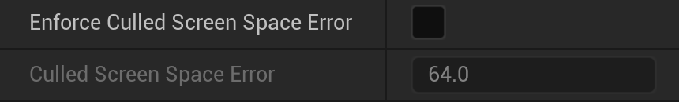
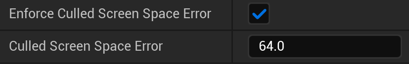
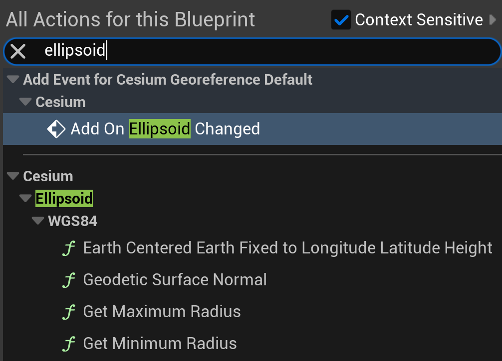
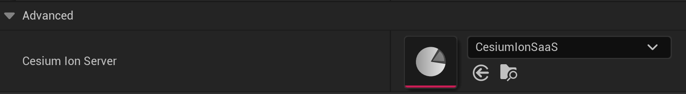
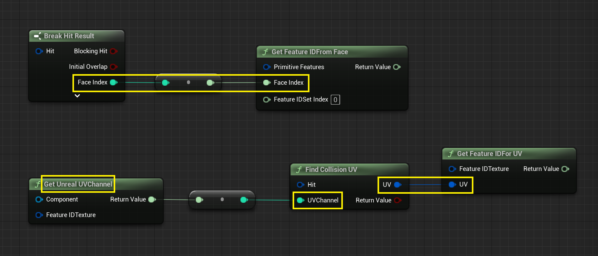

# API Design Guide

Cesium for Unreal unlocks geospatial capabilities in Unreal Engine while also enabling developers to take advantage of in-engine features. As a result, people who use the plugin can often come with existing Unreal knowledge.

In order to make Cesium's integration as seamless as possible, we aim to mirror the paradigms and APIs of the engine where we can. This guide provides best practices for how we do that.

## Table of Contents

- [UObject Design](#uobject-design)
  - [Overview](#overview)
  - [Best Practices](#best-practices)
  - [Quick Reference](#quick-reference)
- [Blueprints](#blueprints)
- [Deprecation and Backwards Compatibility](#deprecation-and-backwards-compatibility)

## UObject Design

`UObject` is the underlying base class of gameplay objects in Unreal Engine. Most classes in the Cesium for Unreal plugin inherit from `UObject`, such that they expose their functionality to the systems in Unreal Engine.

The [Overview](#overview) points out some of the components involved when designing `UObject`s. If you are already familiar with these, feel free to skip to the [Best Practices](#best-practices) section.

### Overview

#### `UObject`

> [Official Unreal Engine Documentation](https://dev.epicgames.com/documentation/en-us/unreal-engine/objects-in-unreal-engine)

The official documentation already contains a summary of `UObject`, so we won't duplicate that here. However, the [UObject Creation](https://dev.epicgames.com/documentation/en-us/unreal-engine/objects-in-unreal-engine#uobjectcreation) and [Destroying Objects](https://dev.epicgames.com/documentation/en-us/unreal-engine/objects-in-unreal-engine#destroyingobjects) sections have a few elements of note:

- `UObject`s may only use default constructors. In other words, a `UObject` cannot have a constructor with arguments.
- For Actors or Actor Components, use the `BeginPlay()` method for specific initialization behavior.
- `UObject`s are automatically garbage collected when they are no longer referenced. Therefore, be mindful of "strong references" that can keep them alive (e.g., UProperties, class instances, `TStrongObjectPtr`).

#### Properties

> [Official Unreal Engine Documentation](https://dev.epicgames.com/documentation/en-us/unreal-engine/unreal-engine-uproperties)

`UObject`s often contain member variables (or properties) important to the object's gameplay logic. However, beyond declaring the property in C++, you need an extra step to Unreal Engine recognize (and later manipulate) those variables.

The `UPROPERTY` macro identifies such properties. This macro should be put above a property that you wish to expose to Unreal Engine. Once recognized, the properties can be acted upon, e.g., made accessible through Blueprints or the Editor UI. It may also be used to enable event handlers and delegates.

#### Functions

> [Official Unreal Engine Documentation](https://dev.epicgames.com/documentation/en-us/unreal-engine/ufunctions-in-unreal-engine)

`UFUNCTION` is the equivalent of `UPROPERTY` for C++ functions. By using this macro, a function can be made accessible to Blueprints, or even as a button in the Editor interface.

#### Enums

`UENUM` is used for any enum classes that Unreal should use in a `UObject` context, e.g., as a type for `UPROPERTY` or Blueprints. `UENUM` should be used on an `enum class` of `uint8`; it typically does not work on pure `enum`s.

```c++
UENUM()
enum class EMyEnum : uint8
{
  ...
};
```

#### Specifiers

Many `UObject` macros take arguments that influence their scope and behavior. The [Quick Reference](#quick-reference) is included so you can focus on the most relevant ones.

For example, check out the `MaximumScreenSpaceError` property on `ACesium3DTileset`:

```c++
  UPROPERTY(
      EditAnywhere,
      BlueprintGetter = GetMaximumScreenSpaceError,
      BlueprintSetter = SetMaximumScreenSpaceError,
      Category = "Cesium|Level of Detail",
      meta = (ClampMin = 0.0))
  double MaximumScreenSpaceError = 16.0;
  ```

- The `EditAnywhere` specifier allows the property to show up in the Details panel of the Unreal Editor. The user can thus modify the value directly.
- The `BlueprintGetter` and `BlueprintSetter` define specific functions for getting and setting the value in Blueprints (see [UFunctions](#ufunctions)).
- The `Category` indicates how the property should be organized in the Details panel. It appears under the "Level of Detail" category, which itself is under a larger "Cesium" category.
- Finally, `meta` refers to additional metadata that can augment how the property functions or appears. Here, `ClampMin` prevents it from being set to an invalid value.

The official documentation for `UPROPERTY` explains the fundamentals, but it is not comprehensive. This [masterlist](https://benui.ca/unreal/uproperty/) of `UPROPERTY` specifiers by ben ui provides a more extensive look into what's possible. 

The `UFUNCTION` macro also takes multiple arguments to influence its behavior. 
For instance,

```c++
  UFUNCTION(
      BlueprintPure,
      Category = "Cesium",
      meta = (ReturnDisplayName = "UnrealPosition"))
  FVector TransformLongitudeLatitudeHeightPositionToUnreal(
      const FVector& LongitudeLatitudeHeight) const;
```

- The `BlueprintPure` specifier allows the function to be executed in a Blueprint graph. The `Pure` keyword indicates that the function will not affect the owning object (`ACesiumGeoreference`) in any way.
- The `Category` indicates how the property should be organized in Blueprint selection panel, under "Cesium" category.
- Finally, `meta` refers to additional metadata that can augment how the property functions or appears. Here, `ReturnDisplayName` specifies how the output will be labeled in the Blueprint node.

`UFUNCTION` must be used for any functions that are used for `BlueprintGetter` or `BlueprintSetter`. For `BlueprintSetter`, the function should be `public` and serve as the mechanism for setting the property from C++. A corresponding `BlueprintGetter` is usually needed for use by C++, even though it is often not needed for Blueprints.

Again, the official documentation for `UFUNCTION` explains the fundamentals, but this [masterlist](https://benui.ca/unreal/uproperty/) of `UFUNCTION` specifiers by ben ui is more extensive. 

### Structs

> [Official Unreal Engine Documentation](https://dev.epicgames.com/documentation/en-us/unreal-engine/structs-in-unreal-engine)

`USTRUCT` is the macro to expose `struct`s to Unreal Engine. They are fairly straightforward, but a few elements of note are:

- `USTRUCT`s don't inherit from `UObject`, so they are not managed by the Garbage Collection system.
- `USTRUCT`s can contain `UPROPERTY`s, and `UObject`s can also have `USTRUCT` type properties.
- `USTRUCT`s can be used in Blueprints depending on their specifiers.
   - `USTRUCT(BlueprintType)` enables the `Make` node (to create the struct).
   - For properties to appear in the `Break` node (for retrieval), they must have either `BlueprintReadOnly` or `BlueprintReadWrite` specifiers.

### Best Practices

The following sections describe some best practices for designing `UObjects` in Cesium for Unreal.

#### Change Detection

Many Cesium for Unreal classes manage an internal state that must be carefully maintained when modifying properties. For instance, when properties on the `ACesiumGeoreference` are changed, it must call `UpdateGeoreference()` immediately after to ensure that all other properties are synced in response.

As a result, `BlueprintReadWrite` is rarely used for properties in Cesium for Unreal. Much of the time, there is additional logic needed after a property is "set", so the change needs to be specifically detected.

We have settled on the following standards for properties that require post-change logic:

1. Declare properties as `private` in the class. This prevents the property from being get or set directly from outside the class in C++ (which is important, because there is no mechanism like `PostEditChangeProperty` or `BlueprintSetter` available in code).
2. Add `Meta = (AllowPrivateAccess)` to the `UPROPERTY`.
3. Add `BlueprintGetter` and `BlueprintSetter` functions.
4. Override the `PostEditChangeProperty` method on the class. This allows it to be notified of changes to the property in the Editor.

There may be a rare case where no action is necessary after setting a certain property from C++. In this case—and as long as this behavior is unlikely to change—the property can be declared in the `public:` section. Such a property is not likely to need `PostEditChangeProperty` or `BlueprintSetter` either.

#### Conditional Properties

In Cesium for Unreal, many `UObject`s have properties that depend on each other to enable behaviors. For instance, a property may only be enabled if some other boolean property is true, or if an enum property is set to a certain value.

`Cesium3DTileset` is a great example for these conditional properties. The enum `Source` property affects whether the `URL` property can be edited. The boolean `Enable Culled Screen Space Error` property activates `Culled Screen Space Error` accordingly.

| Example | Inactive | Active |
| ------- | -------- | ------ |
| Enum |  |  |
| Boolean |  |  |

You can use the `meta = (EditCondition = "")` specifier to implement these conditions. Make sure that conditional properties are listed _below_ the properties that they depend on, both in C++ code and in the Details panel. This reinforces that logic and results in visual clarity.

```c++
  UPROPERTY()
  bool EnableRandomness;

  UPROPERTY(
      meta = (EditCondition = "EnableRandomness"))
  int RandomSeed = 0;
```

The `EditCondition` is able to parse complex boolean logic, but it currently cannot reference functions.

```c++
public:
  UPROPERTY()
  EDataType Type;

  UFUNCTION()
  bool IsNumber(EDataType Type) {
    return Type == EDataType::Int || Type == EDataType::Float || Type == EDataType::Double;
  }
  
  // This won't work...
  UPROPERTY(
    meta= (EditCondition = "IsNumber(Type)"))
  double Offset = 0.0;

  // ...so the check must be done manually.
  UPROPERTY(
    meta= (EditCondition = "Type == EDataType::Int || Type == EDataType::Float || Type == EDataType::Double"))
  double Offset = 0.0;
```

It can only parse `UPROPERTY` values, too, so don't reference any variables that aren't made accessible to Unreal Engine.

> There exists another specifier, `EditConditionHides`, that hides the property from the Details panel rather than making it read-only (visible but greyed out). However, Cesium for Unreal prefers to simply show the properties as read-only. 

#### Organization

Properties should be organized or modified in the Details panel such that they provide an intuitive user experience. Are the properties ordered in a logical manner? Is it clear which properties depend on each other?

Aside from implementing clear [Conditional Properties](#conditional-properties), be diligent about organizing properties in reasonable groups using the `Category` specifier. Most classes, properties, and functions in Cesium for Unreal are put under a broad `Cesium` category. But there are typically subcategories that should be accounted for, too. This can be achieved by using the `|` delimiter in the category name.

```c++
// Falls under the general "Cesium" category.
 UFUNCTION(Category = "Cesium")
 void RefreshTileset();

 // Nested under "Cesium" > "Debug".
 UPROPERTY(Category = "Cesium|Debug")
 bool SuspendUpdate;
 ```

This categorization will apply to Blueprints as well. Use categories to make the scopes of functions obvious from a glance. For example, it is easy to find which functions are relevant to `CesiumEllipsoid` due to their category:



Properties under the same category should also be adjacent in C++ to reinforce the logical grouping. For example, don't interleave categories like this in C++ code:

```c++
  UPROPERTY(EditAnywhere, BlueprintReadWrite, Category = "Cesium|Debug")
  bool SuspendUpdate;

  UPROPERTY(Category = "Cesium|Tile Loading")
  bool PreloadAncestors;

  UPROPERTY(EditAnywhere, Category = "Cesium|Debug")
  bool UpdateInEditor;
```

Group them together:

```c++
  UPROPERTY(EditAnywhere, BlueprintReadWrite, Category = "Cesium|Debug")
  bool SuspendUpdate;

  UPROPERTY(EditAnywhere, Category = "Cesium|Debug")
  bool UpdateInEditor;

  UPROPERTY(Category = "Cesium|Tile Loading")
  bool PreloadAncestors;
```

Additionally, keep in mind the order in which properties will appear. A good principle is to start with properties that are fundamental to the `UObject`. They can then cascade into more advanced settings further down the Details panel. For instance, this is the order of properties as they appear in `CesiumGeoreference.h`:

```c++
  // This determines whether latitude / longitude / height are even used, so it appears first.
  UPROPERTY()
  EOriginPlacement OriginPlacement = EOriginPlacement::CartographicOrigin;
  
  UPROPERTY()
  double OriginLatitude;

  UPROPERTY()
  double OriginLongitude;
  
  UPROPERTY()
  double OriginHeight;

  // Users are less likely to modify the scale of the georeference, so it appears near the end.
  UPROPERTY()
  double Scale = 100.0;
```

Sometimes Unreal will position certain properties out-of-order, e.g., listing `UObject`-pointer properties below everything else. You can use `meta = (DisplayAfter = "")` or `meta = (DisplayPriority = 0)` specifiers to control the order in which properties appear. (Examples can be found [here](https://benui.ca/unreal/uproperty/#displayafter).)

You can also use the `AdvancedDisplay` specifier to explicitly delegate properties to the "Advanced" section of a category.



### Quick Reference

For convenience, here is a cheat sheet of some of the most relevant and/or helpful specifiers for use in Cesium for Unreal's development.

#### Blueprints

##### `UPROPERTY`

| Name | What | When to Use |
| ---- | ----- | --------------- |
| `BlueprintReadOnly` | Property is accessible in Blueprints but read-only. | Self-explanatory. | 
| `BlueprintReadWrite` | Property is editable from Blueprints. | When the "set" logic is simple enough that nothing additional must happen after the property is set. If additional logic is required, use `BlueprintSetter` instead. |
| `BlueprintGetter` | Property uses the specified function to get the value. | Whenever you have to use `BlueprintSetter`. | 
| `BlueprintSetter` | Property uses the specified function to set the value. | Whenever you have to do additional work after setting a property, e.g., recomputing the object's internal state. |
| `BlueprintAssignable` | For delegate or event properties, allows the property to be assigned in Blueprints. | Self-explanatory. |

##### `UFUNCTION`

| Name | What | When to Use |
| ---- | ----- | --------------- |
| `BlueprintCallable` | Function can be executed in a Blueprint or Level Blueprint graph. | For functions that depend on a sequence of node execution. For example, `UCesiumEllipsoid::Create` requires that the ellipsoid be created before something is done on it.<br><br>`BlueprintCallable` results in an "execution pin" to indicate what happens after the Blueprint moves on. For `const` functions, no execution pin will be generated, similar to `BlueprintPure`. |
| `BlueprintPure` | Function can be executed in a Blueprint or Level Blueprint graph without an execution pin. | For functions whose execution does not require explicit sequencing logic. For example, `UCesiumEllipsoid::ScaleToGeodeticSurface` will implicitly execute before its value is used, so it does not have to be connected in an explicit execution sequence. |
| `BlueprintNativeEvent` | For functions that are designed to be overridden by a Blueprint, this indicates that there is a default native implementation. The implementation function must be named `[OriginalFunctionName]_Implementation`. | For achieving behavior in Blueprints similar to virtual functions. In reality, not used that often. |
| `meta = (ReturnDisplayName = "")` | Function output on the Blueprint node will be labeled with the specified name. | Good to use in general for visual clarity. |

#### Details Panel

##### `UPROPERTY`

| Name | What | When to Use |
| ---- | ----- | --------------- |
| `VisibleAnywhere` | Property is read-only in the Details panel. | For read-only variables. Don't use this for variables that shouldn't be visible to the user (e.g., implementation details, internal state management). |
| `EditAnywhere` | Property is editable in the Details panel. | For properties that should be user-editable through the Editor UI. |
| `AdvancedDisplay` | Property is separated into a dropdown "advanced" section that is hidden by default. | For advanced or complex properties that won't realistically be used by most users, e.g., `ACesium3DTileset::CesiumIonServer`. This prevents beginners from being confused, while still allowing advanced users to access that functionality. |
| `meta = (DisplayName = "")` | Property name is changed to `DisplayName` in the Details Panel (as well as its corresponding Blueprint). | Can be used to shorten property names or reword them for clarity. |
| `meta = (DisplayAfter = "")` | Property will be displayed below the `DisplayAfter` property in the Details Panel. | See [Organization](#organization). |
| `meta = (DisplayPriority = 0)` | Property will be assigned and sorted by numeric priority in the Details Panel. | See [Organization](#organization). |
| `meta = (EditCondition = "")` | Property is read-only if `EditCondition` is not met. | See [Conditional Properties](#conditional-properties). |
| `meta = (ClampMin = 0)` | Property is clamped to the minimum value or higher when edited in the Details panel. | To avoid invalid numeric values, e.g., an `OriginLatitude` below -90 degrees. |
| `meta = (ClampMax = 0)` | Property is clamped to the maximum value or lower when edited in the Details panel. | To avoid invalid numeric values, e.g., an `OriginLatitude` above 90 degrees. |
| `meta = (ShowOnlyInnerProperties)` | For `struct` properties, display their properties without nesting them in an expandable dropdown. | Use sparingly. This can help reduce visual clutter, e.g., to remove a level from multiple nested dropdowns. However, don't use this when the `struct`'s name is important for clarity. |
| `meta = (ValidEnumValues="A, B")` | Property is restricted to the enum values listed in the string. | Useful for limiting which values are acceptable for property. Avoids having to duplicate enum values or handling special cases. |
| `meta = (InvalidEnumValues="A, B")` | Property is disallowed from being the enum values listed in the string. | When writing the above specifier is too tedious. |

##### `UFUNCTION`

| Name | What | When to Use |
| ---- | ----- | --------------- |
| `CallInEditor` | Function can be executed using a button in the Details panel. | Any helpful in-editor functionality that a user can easily access, e.g., `RefreshTileset`. Note that the function must have _no parameters_ and _no return value_. |
|

#### Miscellaneous

##### `UPROPERTY`

| Name | What | When to Use |
| ---- | ----- | --------------- |
| `Transient` | Property is editable in the Details panel. | For properties that should be user-editable through the Editor UI. |
| `meta = (AllowPrivateAccess)` | Property that is `private` in C++ can be accessed in Blueprints. | Use in accordance with the practices under [Change Detection](#change-detection). |
| `meta = (DeprecatedProperty) ` | Property is marked as deprecated. | See [Deprecation and Backwards Compatibility](#deprecation-and-backwards-compatibility). |

##### `UFUNCTION`

| Name | What | When to Use |
| ---- | ----- | --------------- |
| `meta = (DeprecatedFunction)` | Function is marked as deprecated. | See [Deprecation and Backwards Compatibility](#deprecation-and-backwards-compatibility). |

## Blueprints 

Blueprints are a visual scripting option in Unreal Engine that many users use over C++ code. Thus, part of the API design in Cesium for Unreal includes creating sensible Blueprints for less code-savvy users.

Try to defer to Unreal Engine's naming schemes for existing Blueprint functions and parameters. For example, texture coordinates in Blueprints are often referred to as "UV". Cesium for Unreal tries to match this by naming its own texture coordinate parameters as "UV".



Ideally, the language between our Blueprints and those of Unreal Engine should be well-integrated. Users should not be confused translating the same concepts between Blueprints sets.

## Deprecation and Backwards Compatibility

Sometimes API changes happen. Thankfully, in Unreal Engine there are several measures to help users transition and prevent frustration such changes.

### Macros and Specifiers

First, read this short and sweet [overview](https://squareys.de/blog/ue4-deprecating-symbols/) by Jonathan Hale that explains how to deprecate anything in Unreal Engine. This section expands briefly on some points, but most of it is already covered.

- Use the `DeprecationMessage` should succinctly inform the user of the deprecation and redirect them to its replacement, if applicable.

```c++
  UFUNCTION(
      Meta =
          (DeprecatedFunction,
           DeprecationMessage =
               "CesiumMetadataPrimitive is deprecated. Get the associated property texture indices from CesiumPrimitiveMetadata instead."))
  static const TArray<FString>
  GetFeatureTextureNames(UPARAM(ref)
                             const FCesiumMetadataPrimitive& MetadataPrimitive);
```

- If a `struct` or `class` is deprecated, prefer to use the `UE_DEPRECATED` macro in a forward declaration of the class before it is actually defined. For example:

```c++
// Forward declare the class with the UE_DEPRECATED macro.
struct UE_DEPRECATED(
    5.0,
    "FCesiumMetadataPrimitive is deprecated. Instead, use FCesiumPrimitiveFeatures and FCesiumPrimitiveMetadata to retrieve feature IDs and metadata from a glTF primitive.")
    FCesiumMetadataPrimitive;

// Actual definition below.
USTRUCT(BlueprintType)
struct CESIUMRUNTIME_API FCesiumMetadataPrimitive { ... }
```

- For backwards compatibility, sometimes you'll need to keep references to the deprecated classes or functions in C++ code. If this is the case, then be sure to wrap the relevant lines in `PRAGMA_DISABLE_DEPRECATION_WARNINGS` and `PRAGMA_ENABLE_DEPRECATION_WARNINGS`. This will reduce the spam in the Unreal logs that can otherwise occur during the build process.

```c++
struct LoadPrimitiveResult { 
  // List of properties here...

  PRAGMA_DISABLE_DEPRECATION_WARNINGS
  // For backwards compatibility with CesiumEncodedMetadataComponent.
  FCesiumMetadataPrimitive Metadata_DEPRECATED{};
  PRAGMA_ENABLE_DEPRECATION_WARNINGS

  // Other properties here...
};
```

### Core Redirects

> [Official Documentation](https://dev.epicgames.com/documentation/en-us/unreal-engine/core-redirects-in-unreal-engine).

Whether you're renaming a class, function, property, or even an enum, it is possible to link between the old and new names to preserve existing Blueprint scripts. This is done using the `[CoreRedirects]` item in `Config/Engine.ini`.

One note: ensure that any entries are on the same line, otherwise they will not be parsed correctly.

### Versioning

`CesiumCustomVersion.h`
