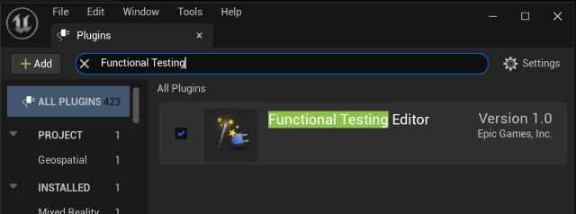
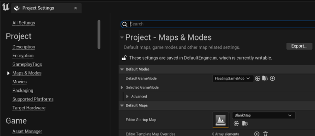
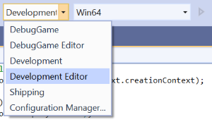

# Set up a repeatable test {#performance-profiling-setup-test}

We need an area of code to execute repeatedly, with as many variables locked down as possible.

### Set up Unreal

1. Open Unreal Editor (UnrealEditor.exe)
2. Create a blank map (project doesn't matter. Choose an existing one or create a new one)
3. Go to Edit->Plugins
4. Search for "Functional Testing plugin". Check it to enable it
   
5. Save all
6. Set this map as the 'Editor Startup Map' so it loads when starting from Visual Studio
   

### Build Release Code

We need to make sure all our C++ code is building in release mode, preferably with debug symbols.

> This assumes that you have already built your code successfully and are familiar with the concepts from our [developer setup guide](https://github.com/CesiumGS/cesium-unreal/blob/ue5-main/Documentation/developer-setup-windows.md). Although you could profile a debug build, it is typically more useful to build in release, since this is how a game is usually packaged.

1. If building the cesium-native library, make sure you are using a release configuration derived from "RelWithDebInfo"
2. Open your Unreal project's Visual Studio solution (.sln). This example uses the solution generated from [cesium-unreal-samples](https://github.com/CesiumGS/cesium-unreal-samples)
3. Choose "Development Editor"

   

4. From the menu, choose Build -> Build Solution
