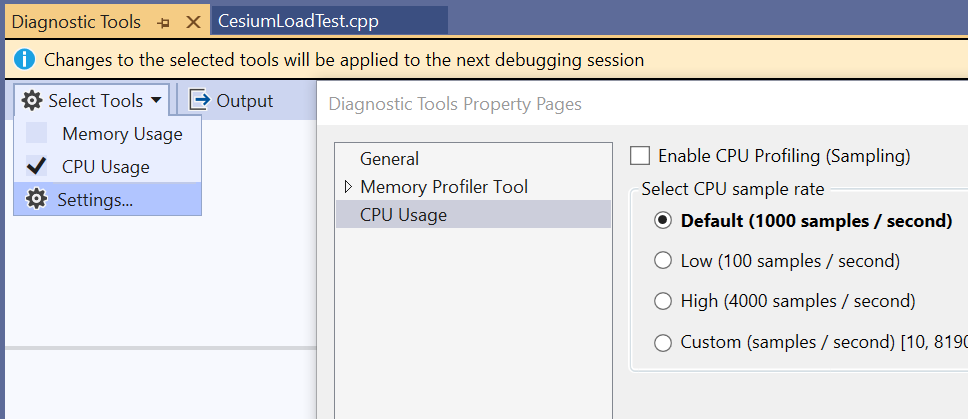
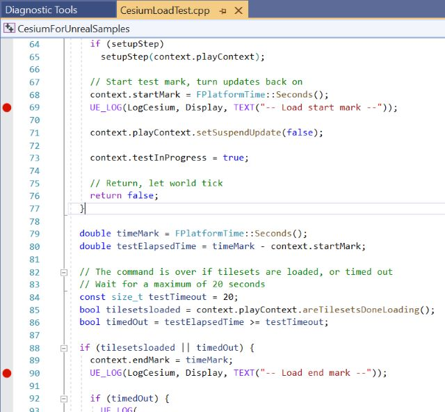
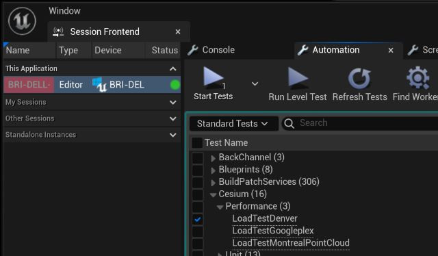
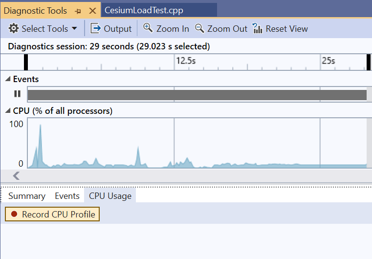
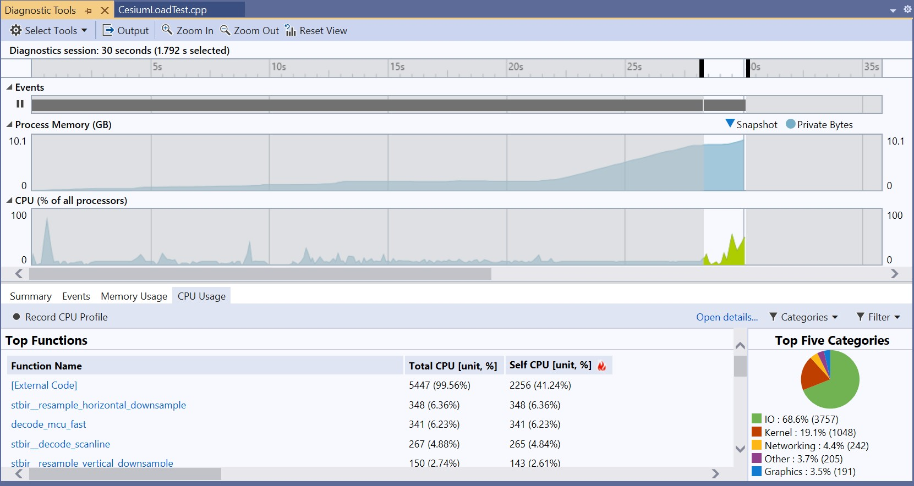
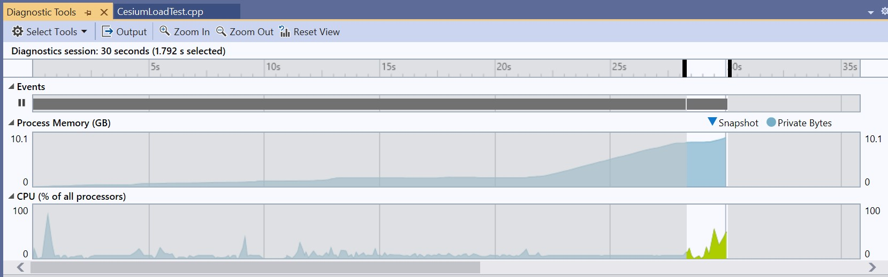
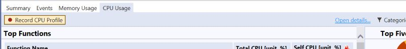
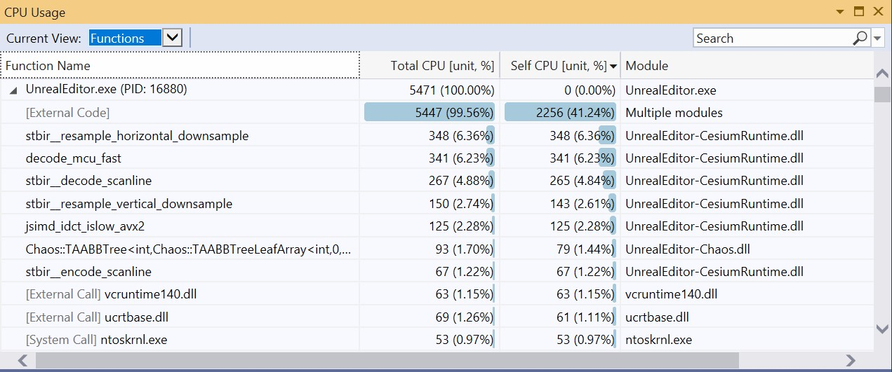
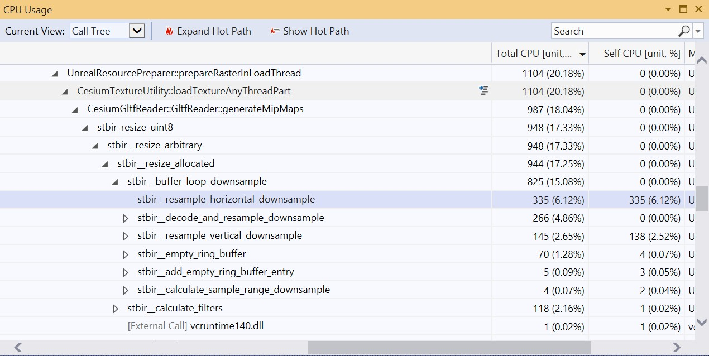

# Performance Profiling with CPU Usage {#performance-profiling-cpu-usage}

This guide will help you find performance problems in your C++ code using the [CPU Usage tool](https://learn.microsoft.com/en-us/visualstudio/profiling/beginners-guide-to-performance-profiling?view=vs-2022) included in Visual Studio's Diagnostic tools window.

The CPU Usage tool is easy to set up with minimal impact on how your app is built or how it runs. If you use Visual Studio often, you may have this running already. This is a sampling-based profiler, with pros and cons detailed [here](https://learn.microsoft.com/en-us/visualstudio/profiling/understanding-performance-collection-methods-perf-profiler?view=vs-2022).
<!--! [TOC] -->

# Set up a repeatable test

In this example, we will use our Cesium performance tests. Follow the steps outlined [here](performance-profiling-setup-test.md).

# Prepare for capture

### Visual Studio

1. Open your project's Visual Studio solution (.sln). This example uses the solution generated from [cesium-unreal-samples](https://github.com/CesiumGS/cesium-unreal-samples)
2. From the menu, choose Debug->Windows->Show Diagnostic Tools
3. Configure it. Uncheck 'Memory Usage'. Under Settings, Uncheck "Enable CPU Profiling", we'll turn this back on later.

4. Optionally, find two places in your code to set breakpoints. In our example, performance test start / end marks are perfect.

> We could profile the entire debugging session if we needed to. But it's generally good practice to reduce your timing capture as much as possible. This can improve responsiveness when using resource intensive profiling tools, like memory tracking.

# Run the timing capture session

1. From Visual Studio, start your debugging session (Debug->Start Debugging, F5)
2. Find the performance tests in Unreal. Tools->Test Automation
   

3. Check "LoadTestDenver"
4. Click "Start Tests"
5. Your first break point should hit in Visual Studio
6. Go back to the Diagnostic Tools window, click on "Record CPU Profile". It should turn red.

7. Continue the debugging session (Debug->Continue, F5)
8. Your second break point should hit
9. Go back to the Diagnostic Tools window, you should now see a report

# Interpret the report

This can be a bit daunting at first, but most profiling tools have a similar workflow.

### Start at the timeline

Note the highlighted area to the right where the CPU usage spikes. This corresponds to the breakpoints that we set.

All data from the report will reflect this selection only.

### Trace calls with high usage

From the main window, click on "Open Details"

The CPU Usage window will appear. Set "Current View" to "Functions", then find the 'Self CPU' column and sort descending (down arrow).

This window now shows the functions that have the highest time spent within themselves only. Useful for finding individual functions that are called often or need to be optimized.

In this example, `stbir_resample_horizontal_downsample` is of particular interest because it's in the code base we built. Entries with `[External]` or originate from an unfamiliar module are generally ignored, although it is useful to know we are calling into them.

Right click on the `stbir_resample_horizontal_downsample` row, select "View in Call Tree".

# Draw conclusions

The window above is starting to show some actionable information:

- 20% of the sampled CPU time was spent in `CesiumTextureUtility::loadTextureAnyThreadPart`. Basically, we're loading textures
- There are a variety of `stbir_XXX functions` that are taking the bulk of the time, and might be candidates for optimization
- The highest cost single function is `stbir_resample_horizontal_downsample`, but keep in mind the limits of a sampling profiler. We don't know how many times it was called, just that it was being executed ~6% of the time.

Are these functions worth investigating and potentially optimizing? Maybe. Again, know this is a sampling profiler. Even if you optimize the highest cost function to 0.001%, you are only improving CPU efficiency.

If your goal is to reach absolute numbers, like specific loading times, or frames per second, you may need another type of profiling tool.
