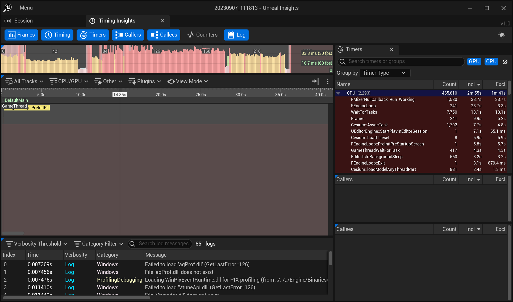

# Performance Profiling with Unreal Insights {#performance-profiling-unreal-insights}

This guide will help you find performance problems in your C++ code using [Unreal Insights](https://docs.unrealengine.com/5.0/en-US/unreal-insights-in-unreal-engine/), included with Unreal Engine.

Unreal Insights can display the scope of timing events as well as activity across threads. There is minimal impact to app execution, and you can set up your own custom events. It provides more functionality than an exclusive [CPU sampling-based profiler](https://learn.microsoft.com/en-us/visualstudio/profiling/understanding-performance-collection-methods-perf-profiler?view=vs-2022), although both tools can complement each other.
<!--! [TOC] -->

# Set up a repeatable test

In this example, we will use our Cesium performance tests. Follow the steps outlined [here](https://github.com/CesiumGS/cesium-unreal/blob/profiling-documentation/Documentation/performance-profiling-setup-test.md).

# Prepare for capture

### Unreal Editor

1. In Visual Studio, click Debug -> Start Debugging (F5)
2. In Unreal, click Tools->Test Automation
3. Check the Cesium.Performance.LoadTestDenver row (don't start the test yet)
   
4. Click Tools->Run Unreal Insights
5. In Unreal Insights, click on the "Connection" tab (don't connect yet)

> You can also find UnrealInsights.exe in `UE_5.X/Engine/Binaries/Win64`

# Run the timing capture session

1. In Unreal Insights, click "Connect"
2. In Unreal Editor, click "Start Tests" (you should already have the Test Automation window open)
3. When the test ends, close Unreal Editor. We don't need it anymore.
4. In Unreal Insights, click the Trace Store tab, notice the trace that was just created
5. Click on it, then click on the 'Open Trace' button

> On the right side, there's a "Explore Trace Store Directory" button. You can click on this to delete or organize your traces

# Interpret the report

By default, the Timings Insights Tab is shown. More detail can be found [here](https://docs.unrealengine.com/5.0/en-US/timing-insights-in-unreal-engine-5/).

For this session, there are several sections of interest for us:

- The Frames panel (top, a timeline view)
- The Timings panel (middle, mostly empty because nothing is selected)
- The Log Panel (bottom)
- The Timers tab (right)

### Isolate your area of interest

1. In the Log Panel, search for "mark". This will show the logging of our timing marks for our test. Select the start mark, then hold shift and down arrow to select the end mark too
   

2. Notice that the Timings panel is now displaying timing data, with a specific time region highlighted
3. In the Timings panel, select View Mode -> Compact Mode to see more of a bird's eye view
4. Select All Tracks and uncheck the following threads that don't have much activity for our test: `RenderThread 3-7, BackgroundThreadPool #1, ForegroundWorker #0-#1, DDC IO ThreadPool #0-#2, Reserve Worker #0-#13, AudioMixerXXX`
5. Use the mouse wheel to zoom in to selected region. Right click and drag to pan left and right.

The view should be a lot cleaner now

### Examine high traffic timers

Let's look at the Timers tab.

Every row is a timing event. Some events come from the engine, some are custom timers in the Cesium for Unreal plugin code. You'll notice that Incl is sorting descending, showing the events with the highest inclusive time.

> You may feel the need to jump right in to `Cesium::CreateRHITexture2D`. It seems to have one of the highest exclusive times (Excl) of any of the events in the list, 1 second. After all, our selection is only 1.2 seconds long, so this must be the performance bottleneck right? Hold on. The total sampled time at the top (CPU) is 19.8s, indicating the times are the total sampled times across threads, not absolute session duration.

Given that the sampled time of the highest cost calls are actually somewhat small compared to the total sampled CPU time, our bottleneck is most likely outside of our timed events.

This brings us to...

### Examine low use areas

1. Go back to the Timings panel.
2. In All Tracks, check Game Frames
3. Turn off compact mode by unchecking "View Mode->Compact Mode".
4. In View Mode, set "Depth Limit" to "4 lanes"
5. Zoom and pan to an area of the selection where the background workers haven't started loading yet

The selected area is the first phase of the loading test. This is a region between when the start mark was logged until when background workers start loading models.

It lasts about 8 game frames, or 388 ms, and does not seem to be making use of background threads at all. Could be something to investigate.

### Examine fragmented use areas

1. Find the Timings panel
2. In View Mode, set "Depth Limit" to "Unlimited"
3. Zoom a bit into an area where our background workers are very busy

This selected area is zoomed in enough to see that the background workers are all calling the same functions. They finish their work, then wait for more work to be available. Some of this work seems to take longer than others, especially at the beginning.

Note the gaps between the work. In general, there seems to be more inactivity than activity during this timeframe. Ideally, we would like to see all work squished together, with no waits in between. Improvements like this should bring the total execution duration lower. In this case, total load time.

# Draw conclusions

We've identified some actionable information so far, even if it only leads to investigation:

- There is a 388 ms low use area at the beginning of the test (~30%). What is happening here? Can it be faster?
- During high use areas, background threads seems to inactive more than they are active. Why? Can this be optimized so they are always active?

It's very common for profiling to be an iterative process. The result of a profiling session could easily be just adding more event timers, or digging deeper into how something works. Before we can expect that code change that results in a heroic 10x speedup, we need to be able to see clearly what is going on.
