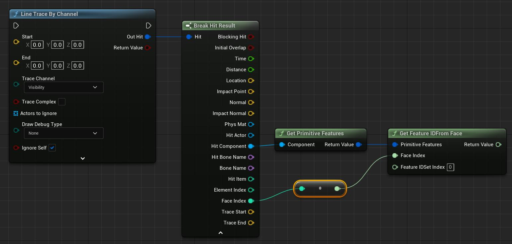
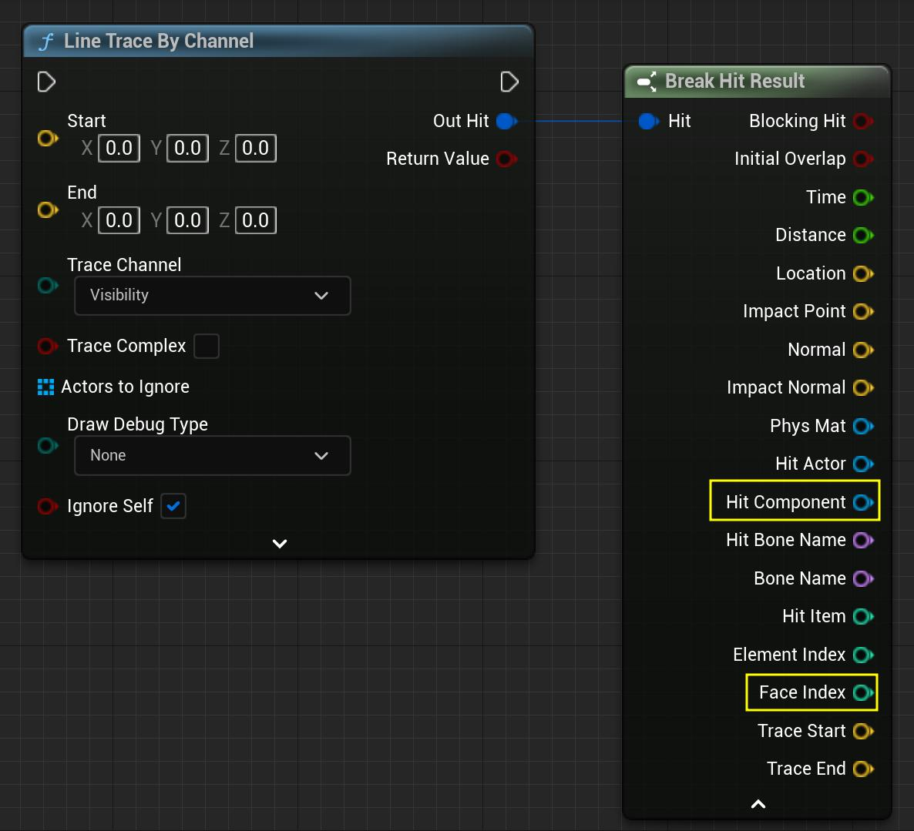
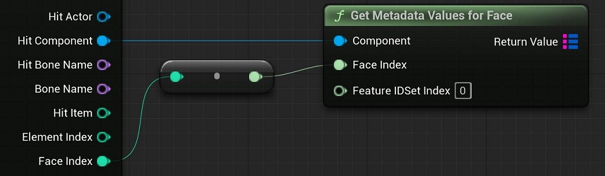
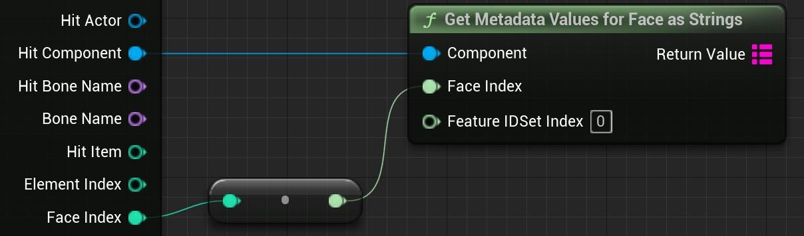
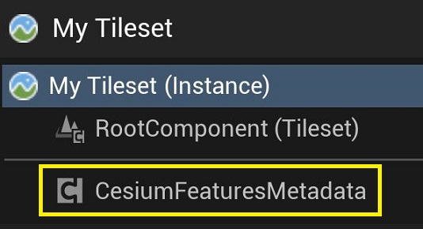
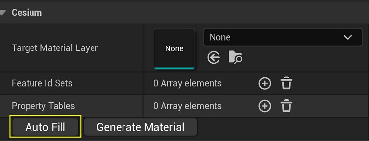
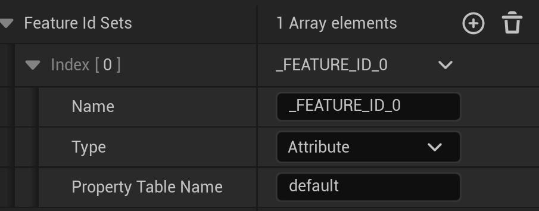
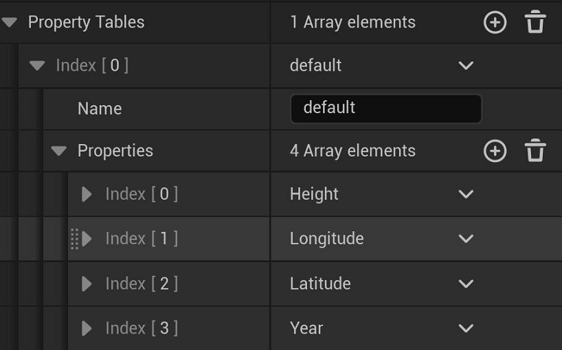
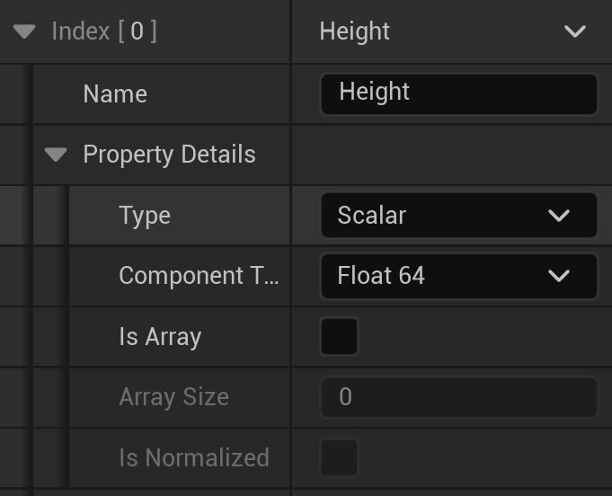
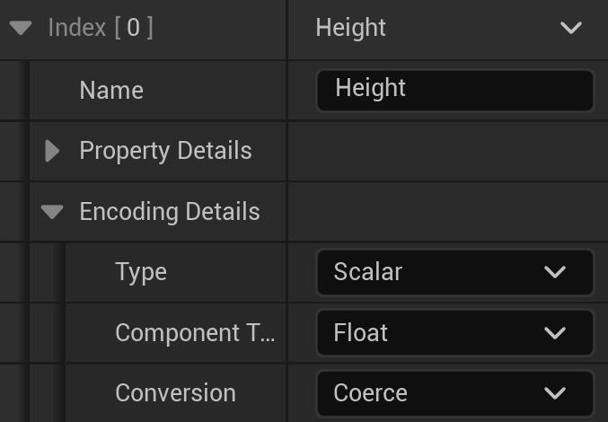

# Cesium for Unreal v2.0 Upgrade Guide

As of v2.0.0, Cesium for Unreal supports the `EXT_mesh_features` and `EXT_structural_metadata` extensions from 3D Tiles 1.1. Models with `EXT_features_metadata` will still load, but their feature IDs and metadata will no longer be accessible. Some differences between the extensions – in particular, differences between possible metadata types and the ways that property collections were accessed or stored – required an overhaul of the metadata-accessing API in Unreal.

 This guide intends to inform users of the differences between the old and new metadata APIs. While there are measures in-place to ensure backwards compatibility, be sure to make a backup of your project before switching Cesium for Unreal versions.

## Table of Contents

- [Retrieving Feature IDs From `EXT_mesh_features`](#ext-mesh-features)
- [Retrieving Metadata From `EXT_structural_metadata`](#ext-structural-metadata)
- [Styling with `EXT_mesh_features` and `EXT_structural_metadata`](#styling)

<h2 id="ext-mesh-features">Retrieving Feature IDs From EXT_mesh_features</h2>

Feature IDs and metadata were previously stored together in the `EXT_feature_metadata` extension. Now, in 3D Tiles 1.1, feature IDs are indicated by the `EXT_mesh_features` extension, which can exist independently of `EXT_structural_metadata`. The new extension does not result in many differences for the Cesium for Unreal API. The most notable change is the deprecation of `FCesiumMetadataPrimitive`, which has been replaced by the more appropriately named `FCesiumPrimitiveFeatures`.

See the complete `EXT_mesh_features` specification [here](https://github.com/CesiumGS/glTF/tree/3d-tiles-next/extensions/2.0/Vendor/EXT_mesh_features).

### Summary

- Deprecated `FCesiumMetadataPrimitive`. Use `FCesiumPrimitiveFeatures` to enact on feature IDs stored in the `EXT_mesh_features` of a glTF primitive.
- Added `FCesiumFeatureIdSet`, which represents a feature ID set in `EXT_mesh_features`.
- Added `ECesiumFeatureIdSetType`, which indicates whether a `FCesiumFeatureIdSet` is a feature ID attribute, a feature ID texture, or a set of implicit feature IDs.
- Added `UCesiumFeatureIdSetBlueprintLibrary`, which acts on a given `FCesiumFeatureIdSet`.
- Added `FCesiumFeatureIdTexture.GetFeatureIDForVertex`, which can retrieve the feature ID of the given vertex if it contains texture coordinates.
- Added `ECesiumFeatureIdAttributeStatus` and `ECesiumFeatureIdTextureStatus`, which indicate whether a feature ID attribute or texture is valid, respectively.
- Deprecated `GetFeatureTableName` for both `UCesiumFeatureIdAttributeBlueprintLibrary` and `UCesiumFeatureIdTextureBlueprintLibrary`. Instead, use `UCesiumFeatureIdSetBlueprintLibrary::GetPropertyTableIndex` to retrieve the index of a property table.

### Feature ID Sets

Feature IDs are stored in a `FCesiumFeatureIdSet`. A `FCesiumFeatureIdSet` has a `ECesiumFeatureIdSetType` indicating whether it is a feature ID attribute, a feature ID texture, or a set of implicit feature IDs. The feature ID of a given vertex can be obtained in Blueprints with the **"Get Feature ID For Vertex"** node. This will sample a `FCesiumFeatureIdSet` for the feature ID, regardless of its type.

If the `FCesiumFeatureIdSet` is a feature ID attribute, the **"Get As Feature ID Attribute"** node can be used to interact with the underlying `FCesiumFeatureIDAttribute`. Similarly, if the `FCesiumFeatureIdSet` is a feature ID texture, the **"Get As Feature ID Texture"** can be used.

Implicit feature ID sets have no counterpart – they simply correspond to the indices of vertices in the mesh.

### Interfacing with Property Tables

In `EXT_feature_metadata`, feature IDs were associated with feature tables by name. The name was used to retrieve the corresponding feature table from a map of feature tables in the model's root `EXT_feature_metadata` extension.

This changes with 3D Tiles 1.1. In `EXT_mesh_features`, feature IDs are optionally associated with property tables from `EXT_structural_metadata`. If a `FCesiumFeatureIDSet` is associated with a property table, it will have a property table *index*. This value indexes into an array of property tables in the model's root extension.

The property table index of a feature ID set can be retrieved with the **"Get Property Table Index"** Blueprint node. See Property Tables for more information.

### Feature ID Attributes and Textures

Property tables are retrieved by index in `EXT_structural_metadata`, so the **"Get Feature Table Name"** Blueprints functions have been deprecated. Aside from this, `FCesiumFeatureIdAttribute` and `FCesiumFeatureIdTexture` are mostly unchanged. 

Previously, a feature ID attribute or texture would not indicate that it was somehow broken, and thus unable to return accurate feature IDs. For example, if the image of a feature ID texture did not actually exist, nothing in the Cesium for Unreal API would communicate that. Thus, the `ECesiumFeatureIdAttributeStatus` and `ECesiumFeatureIdTextureStatus` enums were added to indicate when something in a feature ID set is invalid. These statuses can be queried using the **"Get Feature ID Attribute Status"** and **"Get Feature ID Texture Status"** nodes respectively.

This can be used for debugging and validation purposes, e.g., to check if a `FCesiumFeatureIdAttribute` or `FCesiumFeatureIdTexture` are valid before trying to sample them for feature IDs.

Furthermore, if the **"Get As Feature ID Attribute"** or **"Get As Feature ID Texture"** nodes are used on a `FCesiumFeatureIdSet` of the wrong type, they will return invalid `FCesiumFeatureIdAttribute` and `FCesiumFeatureIdTexture` instances.

### Primitive Features

The `FCesiumPrimitiveFeatures` struct acts as a Blueprints-accessible version of `EXT_mesh_features`. It allows access to all of the feature ID sets of a primitive using the **"Get Feature ID Sets"** Blueprints function. The **"Get Feature ID Sets Of Type"** function can also be used to filter for a specific type of feature IDs.

Previously, users could use the **"Get Feature ID From Face ID"** function to sample feature IDs from a `FCesiumMetadataPrimitive`. This function has been deprecated in Cesium for Unreal v2.0.0. Instead, use **"Get Feature ID From Face"**. This function retrieves the feature ID associated with a given face index, from the specified `FCesiumPrimitiveFeatures`. A primitive may have multiple feature ID sets, so this node allows a feature ID set to be specified by index. The index corresponds to the array retrieved by **"Get Feature ID Sets"**.

Here's an example of how one might retrieve feature IDs from a primitive hit by a `LineTrace`:

> **Note**: This function does not interface well with feature ID textures or implicit feature IDs, since these feature ID types make it possible for a face to have multiple feature IDs. In these cases, the feature ID of the first vertex of the face is returned.

Additionally, **"Get First Vertex ID From Face ID"** has been deprecated. Use **"Get First Vertex From Face"** from `UCesiumPrimitiveFeaturesBlueprintLibrary` instead.

<h2 id="ext-structural-metadata">Retrieving Metadata From EXT_structural_metadata</h2>

Building on the `EXT_feature_metadata` specification, `EXT_structural_metadata` adds new metadata types and other options to more granularly define a property. These expansive additions required a rework of the metadata system in Cesium for Unreal.

See the complete `EXT_structural_metadata` specification [here](https://github.com/CesiumGS/glTF/tree/3d-tiles-next/extensions/2.0/Vendor/EXT_structural_metadata).

### Metadata Value Types

In `EXT_structural_metadata`, metadata types are more complex, with too many permutations to reasonably define in one enum. This called for the deprecation of `ECesiumMetadataTrueType`. Now, the type of a metadata property or value is conveyed through the `FCesiumMetadataValueType` struct. This struct is closely modeled after how class property types appear in the extension itself.

A `FCesiumMetadataValueType` has three components:
- `ECesiumMetadataType`, an enum that corresponds to the `type` of a class property in the metadata schema.
- `ECesiumMetadataComponentType`, an enum that corresponds to the `componentType` of a class property. This is only applicable to scalar, `VECN`, and `MATN` types, and will be marked `None` for all other types. 
- `bIsArray`, a boolean that corresponds to the `array` flag in a class property. If `bIsArray` is true, the type represents an array of elements, where the elements are of the given type and component type.

Below are some example type definitions and their interpretations.

| Example | Explanation |
| ------- | ----------- |
| Type: `Boolean` ComponentType: `None` bIsArray: `false` | Describes a boolean property. Values are retrieved as booleans. |
| Type: `Vec2` ComponentType: `Uint8` bIsArray: `false` | Describes a `VEC2` property where the vectors contain unsigned 8-bit integer components. Values are retrieved as two-dimensional unsigned 8-bit integer vectors. |
| Type: `String` ComponentType: `None` bIsArray: `true` | Describes a string array property. Values are retrieved as arrays of strings. |
| Type: `Scalar` ComponentType: `Float32` bIsArray: `true` | Describes a scalar array property where the scalars are single-precision floats. Values are retrieved as arrays of single-precision floats. |

### Expanded Blueprint Types

The `ECesiumMetadataBlueprintType` enum is still used to indicate the best-fitting Blueprints type for a metadata property or value. In Cesium for Unreal v2.0.0, it has been expanded to include the vector and matrix types possible with the `EXT_structural_metadata` extension. Many of these do not have an exact representation in Blueprints, but can be converted to a sufficiently compatible Blueprints type.

The newly supported Blueprints types include:
- `FIntPoint`
- `FVector2D`
- `FIntVector`
- `FVector3f`
- `FVector`
- `FVector4`
- `FMatrix`

Vector property values can be converted to other dimensions for flexibility. For example, a `VEC2` can be returned as a `FVector4` with zeroes in the unused components. A `VEC3` can be returned as a `FVector2D` containing the first two components. Scalars can also be retrieved in vector form, as a vector with the value in all components. Some examples below:

| Original | Converted |
| -------- | --------- |
| `vec2(1, 2)` | `FVector(1, 2, 0)` |
| `vec3(1, 2, 3)` | `FVector2D(1, 2)`. |
| `2.5` | `FVector4(2.5, 2.5, 2.5, 2.5)` |

Unfortunately, there are no perfect representations for `MAT2` and `MAT3` properties in Unreal Engine, but they can still be retrieved from properties as `FMatrix` instances, padded by zeros in the unused components. For example:

| Original | FMatrix |
| ---- | ------ |
| `[1, 2]` `[3, 4]`| `[1, 2, 0, 0]`  `[3, 4, 0, 0]` `[0, 0, 0, 0]` `[0, 0, 0, 0]`|
| `[1, 2, 3]` `[4, 5, 6]` `[7, 8, 9]` | `[1, 2, 3, 0]`  `[4, 5, 6, 0]` `[7, 8, 9, 0]` `[0, 0, 0, 0]` |

Additionally, scalars can be retrieved as an `FMatrix` with the value along its diagonal. For example,

| Original | FMatrix |
| -------- | ------- |
| `2.5` | `[2.5, 0, 0, 0]` `[0, 2.5, 0, 0]` `[0, 0, 2.5, 0]` `[0, 0, 0, 2.5]` |

Keep in mind that while matrices are column-major in `EXT_structural_metadata`, an Unreal Engine `FMatrix` is row-major. The values are transposed to the correct places in the `FMatrix`.

### Metadata Values

`FCesiumMetadataGenericValue` has been renamed to `FCesiumMetadataValue`, but its function remains the same. This struct represents a value retrieved from a metadata property in an abstracted form. In this way, metadata values can be retrieved from properties of different types and acted upon with more generalized behavior.

`UCesiumMetadataGenericValueBlueprintLibrary` has been renamed to `UCesiumMetadataValueBlueprintLibrary`. This also includes the following changes:

- Deprecated `GetTrueType` and `GetTrueComponentType`. Use `GetValueType` to get the type information as a `FCesiumMetadataValueType` instead.
- Renamed `GetBlueprintComponentType` to `GetArrayElementBlueprintType`.

Functions have also been added to retrieve the data of a `FCesiumMetadataValue` as one of the new vector or matrix value types:

- `GetIntPoint`
- `GetVector2D`
- `GetIntVector`
- `GetVector3f`
- `GetVector`
- `GetVector4`
- `GetMatrix`

### Metadata Arrays

`FCesiumMetadataArray` has been renamed to `FCesiumPropertyArray`. It still represents an array of metadata entities where values are retrieved by index.

Accordingly, `UCesiumMetadataArrayBlueprintLibrary` has been renamed to `UCesiumPropertyArrayBlueprintLibrary`. In previous versions, values were retrieved from arrays with a specific type (e.g., **"Get Integer"** or **"Get Boolean"**). However, in v2.0.0, only the **"Get Value"** function exists. This returns the value at the specified index as a `FCesiumMetadataValue`. The type of this value can be found by using **"Get Value Type"** on the resulting `FCesiumMetadataValue`, or **"Get Element Value Type"** on the `FCesiumPropertyArray` it came from. Then, the value can be converted to the appropriate type.

The complete change list concerning property arrays is as follows:

- Added `GetValue` to retrieve values from a `FCesiumPropertyArray` as `FCesiumMetadataValue` instances.
- Deprecated the following functions in `UCesiumPropertyArrayBlueprintLibrary`:
  - `GetBoolean`
  - `GetByte`
  - `GetInteger`
  - `GetInteger64`
  - `GetFloat`
  - `GetFloat64`
  - `GetString`
- Deprecated `GetTrueComponentType`. Use `GetElementValueType` to get the type information as a `FCesiumMetadataValueType` instead.
- Renamed `GetBlueprintComponentType` to `GetElementBlueprintType`.
- Renamed `GetSize` to `GetArraySize`.

### Property Tables

Property tables in `EXT_structural_metadata` evolved from the feature tables in `EXT_feature_metadata`. As such, `FCesiumFeatureTable` has been renamed to `FCesiumPropertyTable`, and `FCesiumMetadataProperty` to `FCesiumPropertyTableProperty` for clarity.

`ECesiumPropertyTableStatus` has been added to indicate whether a property table is valid. Invalid property tables will not have any metadata properties. Additionally, a `FCesiumPropertyTableProperty` can now report its `ECesiumPropertyTablePropertyStatus`, indicating when it has experienced an error. 

Previously, if any properties were invalid, they would be omitted from the property table without explanation. Now, any invalid properties will still be represented in the property table, but can be queried for their status. 

Additionally, `UCesiumFeatureTableBlueprintLibrary` has been renamed to `UCesiumPropertyTableBlueprintLibrary`. This includes the following changes:

- Renamed `GetNumberOfFeatures` to `GetPropertyTableSize`.
- Renamed `GetMetadataValuesForFeatureID` to `GetMetadataValuesForFeature`. Only values from valid properties are retrieved.
- Renamed `GetMetadataValuesAsStringForFeatureID` to `GetMetadataValuesForFeatureAsStrings`. Only strings from valid properties are retrieved.
- Added the `GetPropertyNames` function to retrieve the names of all properties, including invalid ones.
- Added the `FindProperty` function to retrieve a property of a specific name from the property table. Returns an invalid instance if no property in the property table has that name.

Finally, `UCesiumMetadataPropertyBlueprintLibrary` has been renamed to `UCesiumPropertyTablePropertyBlueprintLibrary` with the following changes:

- Deprecated `GetTrueType` and `GetTrueComponentType`. Use `GetValueType` to get the type information as a `FCesiumMetadataValueType` instead.
- Renamed `GetNumberOfFeatures` to `GetPropertySize`.
- Renamed `GetComponentCount` to `GetArraySize`. Note that this will return zero if the property is an array type with arrays that vary in length.
- Renamed `GetBlueprintComponentType` to `GetArrayElementBlueprintType`.
- Added functions to retrieve values as the new vector and matrix types:
  - `GetIntPoint`
  - `GetVector2D`
  - `GetIntVector`
  - `GetVector3f`
  - `GetVector`
  - `GetVector4`
  - `GetMatrix`

### Metadata Picking

*Picking* refers to the act of selecting a feature (e.g., selecting by mouse click), and querying it for information. Typically, picking is used to access the metadata of a particular feature.

in Cesium for Unreal v2.0.0, metadata picking can be easily implemented using a new Blueprint library. Using **"Line Trace By Channel"**, trace a line into the scene upon mouse click. Then, retrieve the **"Hit Component"** and **"Face Index"** from the resulting hit.

Then, simply connect those values to the **"Get Metadata Values For Face"** node. This node queries the component for its `FCesiumPrimitiveFeatures`. Then, it finds the feature ID set specified by the index and gets the feature ID corresponding to the specified face. If the feature ID set has an associated property table index, the node uses the feature ID to retrieve values from the corresponding property table. The values are returned as `FCesiumMetadataValue` instances, mapped by property name.

To retrieve the values as strings, use **"Get Metadata Values For Face As Strings"** instead. This can be helpful for applications that want to display the values as text in a UI.

### TODO: Feature Textures -> Property Textures

- Renamed `FCesiumFeatureTexture` to `FCesiumPropertyTexture`.
- Renamed `FCesiumFeatureTextureProperty` to `FCesiumPropertyTextureProperty`.
- Renamed `UCesiumFeatureTexturePropertyBlueprintLibrary` to `UCesiumPropertyTexturePropertyBlueprintLibrary`. `GetPropertyKeys` is now `GetPropertyNames`.
- Added `FCesiumPropertyArray`, which represents an array retrieved from the `EXT_structural_metadata` extension.
- Renamed `FCesiumMetadataModel` to `FCesiumModelMetadata`, which represents the metadata specified by the `EXT_structural_metadata` extension on the root glTF model.
- Added `FCesiumPrimitiveMetadata`, which represents the metadata specified by the `EXT_structural_metadata` extension on a glTF mesh primitive.
- `FCesiumMetadataPrimitive` has been deprecated. Instead, use `FCesiumPrimitiveFeatures` to access the feature IDs of a primitive and `FCesiumPrimitiveMetadata` to access its metadata.

<h2 id="styling">Styling with EXT_mesh_features and EXT_structural_metadata</h2>

Previously, a `UCesiumEncodedMetadataComponent` could be attached to a Cesium3DTileset to make its `EXT_feature_metadata` accessible in Unreal materials. This component has been deprecated in Cesium for Unreal v2.0.0. Instead, use the `UCesiumFeaturesMetadataComponent`, which handles `EXT_mesh_features` and `EXT_structural_metadata` instead.

Like its predecessor, the `UCesiumFeaturesMetadataComponent` contains descriptions of the feature ID sets and metadata in the tileset. These descriptions can be manually specified, or automatically generated using the **"Auto Fill"** button. **"Auto Fill"** will populate the descriptions based on the tiles currently in-view in the editor.

These descriptions indicate which feature ID sets or metadata should be *encoded* for access on the GPU. Encoding involves converting property values to a GPU-accessible type, then passing them into Unreal materials via texture. Everything that is listed in the descriptions will be encoded, and anything not listed will be skipped. As such, only include feature ID sets and metadata that will be actually used by the application. Otherwise, the unused properties may affect memory and performance.

### Feature ID Set Descriptions

In this description system, feature ID sets across the tileset will be distinguished by their type and name. If a feature ID set is not labeled in the `EXT_mesh_features` extension, a name will be generated for it. Additionally, a feature ID set can specify what property table it is associated with. 

> **Note**: This implementation assumes that feature ID sets with the same name will have the same definition throughout the tileset. If a feature ID set is defined differently between two glTF primitives, it may lead to undefined behavior.
>
> For example, suppose that a primitive's `EXT_mesh_features` contains a feature ID attribute named **"FeatureIDSet0"**. In the same tileset, another primitive can contain a feature ID set named **"FeatureIdSet0"**, but define it as a feature ID texture instead. If the `UCesiumFeaturesMetadataComponent` finds the feature ID attribute first, it will assume that all subsequent instances of **"FeatureIdSet0"** are also attributes. This will result in unexpected behavior when it tries to handle **"FeatureIdSet0"** in the second primitive.

The glTF primitives across the tileset can contain different and multiple feature IDs. As such, when using **"Auto Fill"**, the list of feature ID sets is aggregated from the `EXT_mesh_features` extensions across the *entire* tileset. This may not necessarily match the number or types of feature ID sets that a single primitive has.

### Property Table Descriptions

Property tables across the tileset will be distinguished by name. If a property table is not named in the `EXT_structural_metadata` extension, then the name of its class will be used instead. For example, if an unnamed property table provides data for the class `buildings`, it will labeled as "`buildings`" in the metadata description.

Each property table description contains a list of properties, also distinguished by name. **"Auto Fill"** will include *all* of the properties belonging to *all* property tables across the tileset. Remember to delete all unused properties to avoid unnecessary encoding.

> **Note**: glTF models across a tileset can contain property tables with the same name, but different schemas. Additionally, property tables with the same name may only contain subsets of the properties defined in the schema. As such, not all properties in a property table description are necessary present in every glTF model.
>
> If a property is missing from a property table, it will pass default values to its corresponding parameter in the Unreal material. For example, if a scalar property is missing from a model, the material will receive zero values.

### Property Descriptions (WIP)

The "Property Details" display detailed information about the type of the property, as well as any special characteristics it has (e.g., if it is normalized). This information is taken from its class property definition in the `EXT_structural_metadata` extension.

The "Encoding Details" describe how this property should be encoded for access in the Unreal material.

Unfortunately, not all properties can be neatly encoded into textures. The following property types will not be encoded:

- Enums
- Strings that cannot be parsed as numbers or colors
- Matrices
- Variable-length arrays
- Arrays of non-scalar and non-boolean elements

Additionally, if a property contains arrays of fixed length, only up to the first four components will be encoded.