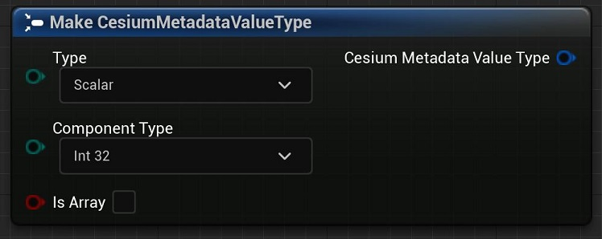

# Cesium for Unreal v2.0 Upgrade Guide

As of v2.0.0, Cesium for Unreal supports the `EXT_mesh_features` and `EXT_structural_metadata` extensions from 3D Tiles 1.1. Models with `EXT_features_metadata` will still load, but their feature IDs and metadata will no longer be accessible. Some differences between the extensions – in particular, differences between possible metadata types and the ways that property collections were accessed or stored – required an overhaul of the metadata-accessing API in Unreal.

 This guide intends to inform users of the differences between the old and new metadata APIs. While there are measures in-place to ensure backwards compatibility, be sure to make a backup of your project before switching Cesium for Unreal versions.

## Table of Contents

- [Retrieving Feature IDs from `EXT_mesh_features`](#ext-mesh-features)
- [Retrieving metadata from `EXT_structural_metadata`](#ext-structural-metadata)

<h2 id="ext-mesh-features">Retrieving Feature IDs from `EXT_mesh_features`</h2>

Fature IDs and metadata used to be stored together in the `EXT_feature_metadata` extension. Now, in 3D Tiles 1.1, feature IDs are indicated by the `EXT_mesh_features` extension, which can exist independent of metadata. Thankfully, the new extension does not result in many differences for the Cesium for Unreal API. The most notable change is the deprecation of `FCesiumMetadataPrimitive`, which has been replaced by the more appropriately named `FCesiumPrimitiveFeatures`.

For the complete `EXT_mesh_features` specification, see [here](https://github.com/CesiumGS/glTF/tree/3d-tiles-next/extensions/2.0/Vendor/EXT_mesh_features).

### Summary

- Deprecated `FCesiumMetadataPrimitive`. Use `FCesiumPrimitiveFeatures` to enact on feature IDs stored in `EXT_mesh_features` on a glTF primitive.
- Added `FCesiumFeatureIdSet`, which represents a feature ID set in `EXT_mesh_features`.
- Added `ECesiumFeatureIdSetType`, which indicates whether a `FCesiumFeatureIdSet` is a feature ID attribute, a feature ID texture, or a set of implicit feature IDs.
- Added `UCesiumFeatureIdSetBlueprintLibrary`, which acts on a given `FCesiumFeatureIdSet`.
- Added `FCesiumFeatureIdTexture.GetFeatureIDForVertex`, which can retrieve the feature ID of the given vertex if it contains texture coordinates.
- Added `ECesiumFeatureIdAttributeStatus` and `ECesiumFeatureIdTextureStatus`, which indicate whether a feature ID attribute or texture is valid, respectively.
- Deprecated `UCesiumFeatureIdAttributeBlueprintLibrary::GetFeatureTableName` and `UCesiumFeatureIdTextureBlueprintLibrary::GetFeatureTableName`. Instead, use `UCesiumFeatureIdSetBlueprintLibrary::GetPropertyTableIndex` to retrieve the index of a property table.

### Feature ID Sets

Feature IDs are stored in a `FCesiumFeatureIdSet`. A `FCesiumFeatureIdSet` has a `ECesiumFeatureIdSetType` indicating whether it is a feature ID attribute, a feature ID texture, or a set of implicit feature IDs. The feature ID of a given vertex can be obtained in Blueprints with the **"Get Feature ID For Vertex"** node. This will sample a `FCesiumFeatureIdSet` for the feature ID, regardless of its type.

If the `FCesiumFeatureIdSet` is a feature ID attribute, the **"Get As Feature ID Attribute"** node can be used to interact with the underlying `FCesiumFeatureIDAttribute`. Similarly, if the `FCesiumFeatureIdSet` is a feature ID texture, the **"Get As Feature ID Texture"** can be used.

Implicit feature ID sets have no counterpart – they simply correspond to the indices of vertices in the mesh.

### Interfacing with Property Tables

In `EXT_feature_metadata`, feature IDs were associated with feature tables by name. The name was used to retrieve the corresponding feature table from a map of feature tables in the model's root `EXT_feature_metadata` extension.

This changes with 3D Tiles 1.1. In `EXT_mesh_features`, feature IDs are optionally associated with property tables from `EXT_structural_metadata`. If a `FCesiumFeatureIDSet` is associated with a property table, it will have a property table *index*. This value indexes into an array of property tables in the model's root extension.

The property table index can be retrieved with the **"Get Property Table Index"** Blueprint node. See Property Tables for more information.

### Feature ID Attributes and Textures

Property tables are retrieved by index in `EXT_structural_metadata`, so it makes less sense to use the **"GetFeatureTableName"** Blueprints functions. Aside from these now-deprecated functions, `FCesiumFeatureIdAttribute` and `FCesiumFeatureIdTexture` are mostly unchanged. 

Previously, Cesium for Unreal would not indicate if a feature ID attribute or texture was somehow broken, and thus unable to return accurate feature IDs. For example, if the image of a feature ID texture did not actually exist, nothing in the old API would communicate that. Thus, the `ECesiumFeatureIdAttributeStatus` and `ECesiumFeatureIdTextureStatus` enums were added. These indicate when something in the feature ID sets is invalid, and can be queried using the **"Get Feature ID Attribute Status"** and **"Get Feature ID Texture Status"** Blueprints nodes respectively.

This can be used for debugging and validation purposes, e.g., to check if a `FCesiumFeatureIdAttribute` or `FCesiumFeatureIdTexture` are valid before trying to sample them for feature IDs.

Furthermore, if the **"Get As Feature ID Attribute"** or **"Get As Feature ID Texture"** nodes are used on a `FCesiumFeatureIdSet` of the wrong type, they will return invalid `FCesiumFeatureIdAttribute` and `FCesiumFeatureIdTexture` instances.

### Primitive Features

The `FCesiumPrimitiveFeatures` struct acts as a Blueprints-accessible version of `EXT_mesh_features`. It allows access to all of the feature ID sets of a primitive using the **"Get Feature ID Sets"** Blueprints function. The **"Get Feature ID Sets Of Type"** function can also be used to filter for a specific type of feature IDs.

Previously, users could use the **"Get Feature ID From Face ID"** function to sample feature IDs from a `FCesiumMetadataPrimitive`. In Cesium for Unreal v2.0.0, this function has been deprecated. Instead, use **"Get Feature ID From Face"**. This function retrieves the feature ID associated with a given face index, from the specified `FCesiumPrimitiveFeatures` and `FCesiumFeatureIdSet`. Here's an example of how one might retrieve the feature ID of a primitive hit by a `LineTrace`:

**Note**: This function does not interface well with feature ID textures or implicit feature IDs, since these feature ID types make it possible for a face to have multiple feature IDs. In these cases, the feature ID of the first vertex of the face is returned.

Additionally, `UCesiumMetadataPrimitiveBlueprintLibrary::GetFirstVertexIDFromFaceID` has been deprecated. Use `GetFirstVertexFromFace` from `UCesiumPrimitiveFeaturesBlueprintLibrary` instead.

<h2 id="ext-structural-metadata">Retrieving metadata from `EXT_structural_metadata`</h2>

Building upon the `EXT_feature_metadata` specifiation, `EXT_structural_metadata` adds new metadata property types, as well as other options to more granularly define a property. These expansive additions required a rework of the metadata type system in Cesium for Unreal.

For the complete `EXT_structural_metadata` specification, see [here](https://github.com/CesiumGS/glTF/tree/3d-tiles-next/extensions/2.0/Vendor/EXT_structural_metadata).

### Metadata Value Types

The biggest change in the metadata-accessing API is the overhaul of the type system. The data types in `EXT_structural_metadata` are more complex, with too many permutations to reasonably define in one enum. This called for the deprecation of `ECesiumMetadataTrueType`. Instead, the type of a metadata property or value is conveyed through the `FCesiumMetadataValueType` struct. This struct is closely modeled after how class property types appear in the extension itself.

`FCesiumMetadataValueType` has three components:
- `ECesiumMetadataType`, which corresponds to the `type` of a class property in the metadata schema.
- `ECesiumMetadataComponentType`, which corresponds to the `componentType` of a class property. This is only applicable to scalar, `vecN`, and `matN` types, and will be marked `None` for all other types. 
- `bIsArray`, a boolean that corresponds to the `array` flag in a class property. If `bIsArray` is true, the type represents an array of elements, where the elements are of the given type and component type.

Below are some example type definitions and their interpretations.

| Example | Explanation |
| ------- | ----------- |
| Type: `Boolean` ComponentType: `None` bIsArray: `false` | Describes a boolean property. Values are retrieved as booleans. |
| Type: `Vec2` ComponentType: `Uint8` bIsArray: `false` | Describes a `vec2` property where the vectors contain unsigned 8-bit integer components. Values are retrieved as two-dimensional unsigned 8-bit integer vectors. |
| Type: `String` ComponentType: `None` bIsArray: `true` | Describes a string array property. Values are retrieved as arrays of strings. |
| Type: `Scalar` ComponentType: `Float32` bIsArray: `true` | Describes a scalar array property where the scalars are single-precision floats. Values are retrieved as arrays of single-precision floats. |

### Expanded Blueprint Types

As with before, the `ECesiumMetadataBlueprintType` enum is still used to indicate the best-fitting Blueprints type for a metadata property or value. In Cesium for Unreal v2.0.0, it has been expanded to include the vector and matrix types possible with the `EXT_structural_metadata` extension. Many of these do not have an exact representation in Unreal Blueprints, but can be converted to a fitting Blueprints type.

The newly supported Blueprints types include:
- `FIntPoint`
- `FVector2D`
- `FIntVector`
- `FVector3f`
- `FVector`
- `FVector4`
- `FMatrix`

Vector property values can be converted to other dimensions for flexibility. For example, a `vec2` can be returned as a `FVector4` with zeroes in the unused components. A `vec3` can be returned as a `FVector2D` containing the first two components. Scalars can also be retrieved in vector form, as a vector with the value in all components. Some examples are below.

| Original | Converted |
| -------- | --------- |
| `vec2(1, 2)` | `FVector(1, 2, 0, 0)` |
| `vec3(1, 2, 3)` | `FVector2D(1, 2)`. |
| `2.5` | `FVector4(2.5, 2.5, 2.5, 2.5)` |

Unfortunately, there are no perfect representations for `mat2` and `mat3` properties in Unreal Engine, but they can still be retrieved from properties as `FMatrix` instances, padded by zeros in the unused components. For example:

| Original | FMatrix |
| ---- | ------ |
| `[1, 2]` `[3, 4]`| `[1, 2, 0, 0]`  `[3, 4, 0, 0]` `[0, 0, 0, 0]` `[0, 0, 0, 0]`|
| `[1, 2, 3]` `[4, 5, 6]` `[7, 8, 9]` | `[1, 2, 3, 0]`  `[4, 5, 6, 0]` `[7, 8, 9, 0]` `[0, 0, 0, 0]` |

Additionally, scalars can be retrieved as an `FMatrix` with the value along its diagonal. For example,

| Original | FMatrix |
| -------- | ------- |
| `2.5` | `[2.5, 0, 0, 0]` `[0, 2.5, 0, 0]` `[0, 0, 2.5, 0]` `[0, 0, 0, 2.5]` |

Keep in mind that while matrices are column-major in `EXT_structural_metadata`, Unreal's `FMatrix` is row-major. The values are transposed to the correct places in the `FMatrix`.

### Metadata Values

In the new API, `FCesiumMetadataGenericValue` has been renamed to `FCesiumMetadataValue`, but its function remains the same. This struct represents a value retrieved from a metadata property in an abstracted form. In this way, metadata values can be retrieved from differently-typed properties and acted upon with more general behavior.

Additionally, `UCesiumMetadataGenericValueBlueprintLibrary` has been renamed to `UCesiumMetadataValueBlueprintLibrary`. This includes the following changes:

- Renamed `GetBlueprintComponentType` to `GetArrayElementBlueprintType`.
- Deprecated `GetTrueType` and `GetTrueComponentType`. Use `GetValueType` to get the type information as a `FCesiumMetadataValueType` instead.

Functions have also been added to retrieve a `FCesiumMetadataValue`'s value as one of the new vector and matrix value types:

- `GetIntPoint`
- `GetVector2D`
- `GetIntVector`
- `GetVector3f`
- `GetVector`
- `GetVector4`
- `GetMatrix`

### Metadata Arrays

`FCesiumMetadataArray` has been renamed to `FCesiumPropertyArray`. It still represents an array of metadata entities where values are retrieved by index. Accordingly, `UCesiumMetadataArrayBlueprintLibrary` has been renamed to `UCesiumPropertyArrayBlueprintLibrary`.

Previously, values were retrieved from arrays with a specific type (e.g., **"Get Integer"** or **"Get Boolean"**). However, in the new API, only the **"Get Value"** function exists. This returns the value at the specified index as a `FCesiumMetadataValue`. The type of this value can be found by using `GetValueType` on the resulting `FCesiumMetadataValue`, or `GetElementValueType` on the `FCesiumPropertyArray` it came from. The value can then be converted to the appropriate type.

The complete change list is as follows:

- Added `GetValue` to retrieve values from the array as `FCesiumMetadataValue` instances.
- Deprecated the following functions in `UCesiumPropertyArrayBlueprintLibrary`:
  - `GetBoolean`
  - `GetByte`
  - `GetInteger`
  - `GetInteger64`
  - `GetFloat`
  - `GetFloat64`
  - `GetString`
- Deprecated `GetTrueComponentType`. Use `GetElementValueType` to get the type information as a `FCesiumMetadataValueType` instead.
- Renamed `GetBlueprintComponentType` to `GetElementBlueprintType`.
- Renamed `GetSize` to `GetArraySize`.

### Property Tables

Property tables in `EXT_structural_metadata` evolved from the feature tables in `EXT_feature_metadata`. As such, `FCesiumFeatureTable` has been renamed to `FCesiumPropertyTable`. Additionally, `FCesiumMetadataProperty` to `FCesiumPropertyTableProperty` for clarity.

Previously, a property table did not report whether or not it was valid. For example, if the table's class was not found in the metadata schema, it would not be populated with any properties, and would not report why. `FCesiumPropertyTableStatus` has been added to indicate whether a property table is valid. Additionally, if any of its properties were invalid, they would be omitted from the property table without explanation. Now, a `FCesiumPropertyTableProperty` reports its `FCesiumPropertyTablePropertyStatus`, indicating when it has experienced an error. Invalid properties will still be represented in the property table, but can be queried for their status. 

Additionally, `UCesiumFeatureTableBlueprintLibrary` has been renamed to `UCesiumPropertyTableBlueprintLibrary`. This includes the following changes:

- Renamed `GetNumberOfFeatures` to `GetPropertyTableSize`.
- Renamed `GetMetadataValuesForFeatureID` to `GetMetadataValuesForFeature`. Only values from valid properties are retrieved.
- Renamed `GetMetadataValuesAsStringForFeatureID` to `GetMetadataValuesForFeatureAsStrings`. Only strings from valid properties are retrieved.
- Added the `GetPropertyNames` function to retrieve the names of all properties, including invalid ones.
- Added the `FindProperty` function to retrieve a property of a specific name from the property table. Returns an invalid instance if such a property cannot be found.

Finally, `UCesiumMetadataPropertyBlueprintLibrary` has been renamed to `UCesiumPropertyTablePropertyBlueprintLibrary` with the following changes:

- Deprecated `GetTrueType` and `GetTrueComponentType`. Use `GetValueType` to get the type information as a `FCesiumMetadataValueType` instead.
- Renamed `GetNumberOfFeatures` to `GetPropertySize`.
- Renamed `GetComponentCount` to `GetPropertyArraySize`. Note that this will return zero if the property is an array type with arrays that vary in length.
- Renamed `GetBlueprintComponentType` to `GetArrayElementBlueprintType`.
- Added functions to retrieve values as the new vector and matrix types:
  - `GetIntPoint`
  - `GetVector2D`
  - `GetIntVector`
  - `GetVector3f`
  - `GetVector`
  - `GetVector4`
  - `GetMatrix`

### TODO: Metadata Picking

### TODO: Feature Textures -> Property Textures

- Renamed `FCesiumFeatureTexture` to `FCesiumPropertyTexture`.
- Renamed `FCesiumFeatureTextureProperty` to `FCesiumPropertyTextureProperty`.
- Renamed `UCesiumFeatureTexturePropertyBlueprintLibrary` to `UCesiumPropertyTexturePropertyBlueprintLibrary`. `GetPropertyKeys` is now `GetPropertyNames`.
- Added `FCesiumPropertyArray`, which represents an array retrieved from the `EXT_structural_metadata` extension.
- Renamed `FCesiumMetadataModel` to `FCesiumModelMetadata`, which represents the metadata specified by the `EXT_structural_metadata` extension on the root glTF model.
- Added `FCesiumPrimitiveMetadata`, which represents the metadata specified by the `EXT_structural_metadata` extension on a glTF mesh primitive.
- `FCesiumMetadataPrimitive` has been deprecated. Instead, use `FCesiumPrimitiveFeatures` to access the feature IDs of a primitive and `FCesiumPrimitiveMetadata` to access its metadata.