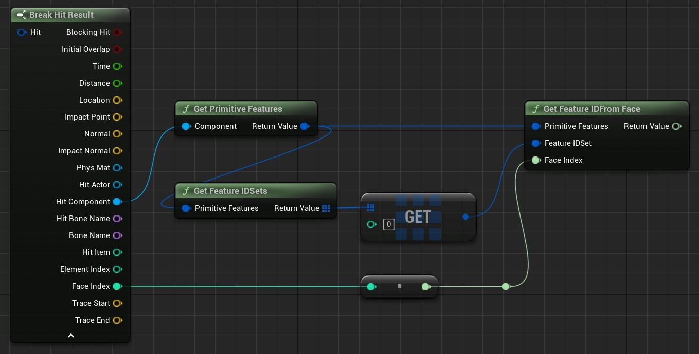

# Cesium for Unreal v2.0 Upgrade Guide

As of v2.0.0, Cesium for Unreal supports the `EXT_mesh_features` and `EXT_structural_metadata` extensions from 3D Tiles 1.1. Models with `EXT_features_metadata` will still load, but their feature IDs and metadata will no longer be accessible. Some differences between the extensions -- in particular, differences between possible metadata types and the ways that property collections were accessed or stored -- required an overhaul of the metadata-accessing API in Unreal.

 This guide intends to inform users of the differences between the old and new metadata APIs. While there are measures in-place to ensure backwards compatibility, be sure to make a backup of your project before switching Cesium for Unreal versions.

## Table of Contents

- [Retrieving Feature IDs from `EXT_mesh_features`](#ext-mesh-features)
- [Retrieving metadata from `EXT_structural_metadata`](#retrieving-metadata-from-ext-structural-metadata)

<h2 id="ext-mesh-features">Retrieving Feature IDs from `EXT_mesh_features`</h2>

Fature IDs and metadata used to be stored together in the `EXT_feature_metadata` extension. Now, in 3D Tiles 1.1, feature IDs are indicated by the `EXT_mesh_features` extension, which can exist independent of metadata. Thankfully, the new extension does not result in many differences for the Cesium for Unreal API. The most notable change is the deprecation of `FCesiumMetadataPrimitive`, which has been replaced by the more appropriately named `FCesiumPrimitiveFeatures`.

For the `EXT_mesh_features` specification, see [here](https://github.com/CesiumGS/glTF/tree/3d-tiles-next/extensions/2.0/Vendor/EXT_mesh_features).

### Summary

- Deprecated `FCesiumMetadataPrimitive`. Use `FCesiumPrimitiveFeatures` to enact on feature IDs stored in `EXT_mesh_features` on a glTF primitive.
- Added `FCesiumFeatureIdSet`, which represents a feature ID set in `EXT_mesh_features`.
- Added `ECesiumFeatureIdSetType`, which indicates whether a `FCesiumFeatureIdSet` is a feature ID attribute, a feature ID texture, or a set of implicit feature IDs.
- Added `UCesiumFeatureIdSetBlueprintLibrary`, which acts on a given `FCesiumFeatureIdSet`.
- Added `FCesiumFeatureIdTexture.GetFeatureIDForVertex`, which can retrieve the feature ID of the given vertex if it contains texture coordinates.
- Added `ECesiumFeatureIdAttributeStatus` and `ECesiumFeatureIdTextureStatus`, which indicate whether a feature ID attribute or texture is valid, respectively.
- Deprecated `UCesiumFeatureIdAttributeBlueprintLibrary::GetFeatureTableName` and `UCesiumFeatureIdTextureBlueprintLibrary::GetFeatureTableName`. Instead, use `UCesiumFeatureIdSetBlueprintLibrary::GetPropertyTableIndex` to retrieve the index of a property table.

### Feature ID Sets

Feature IDs are stored in a `FCesiumFeatureIdSet`. A `FCesiumFeatureIdSet` has a `ECesiumFeatureIdSetType` indicating whether it is a feature ID attribute, a feature ID texture, or a set of implicit feature IDs. The feature ID of a given vertex can be obtained in Blueprints with the **"Get Feature ID For Vertex"** node (or in C++, `UCesiumFeatureIdSetBlueprintLibrary::GetFeatureIDForVertex`). This will sample a `FCesiumFeatureIdSet` for the feature ID, regardless of its type.

If the `FCesiumFeatureIdSet` is a feature ID attribute, the **"Get As Feature ID Attribute"** node can be used to interact with the underlying `FCesiumFeatureIDAttribute`. Similarly, if the `FCesiumFeatureIdSet` is a feature ID texture, the **"Get As Feature ID Texture"** can be used. In C++, these functions are `UCesiumFeatureIdSetBlueprintLibrary::GetAsFeatureIDAttribute` and `UCesiumFeatureIdSetBlueprintLibrary::GetAsFeatureIDTexture` respectively.

Implicit feature ID sets have no counterpart – they simply correspond to the indices of vertices in the mesh.

### Interfacing with Property Tables

In `EXT_feature_metadata`, feature IDs were associated with feature tables by name. The name was used to retrieve the corresponding feature table from a map of feature tables in the model's root `EXT_feature_metadata` extension.

This changes with 3D Tiles 1.1. In `EXT_mesh_features`, feature IDs are optionally associated with property tables from `EXT_structural_metadata`. If a `FCesiumFeatureIDSet` is associated with a property table, it will have a property table *index*. This value indexes into an array of property tables in the model's root extension.

The property table index can be retrieved with the **"Get Property Table Index"** Blueprint node (or in C++,`UCesiumFeatureIdSetBlueprintLibrary::GetPropertyTableIndex`). See Property Tables for more information.

### Feature ID Attributes and Textures

Property tables are retrieved by index in `EXT_structural_metadata`, so it makes less sense to use the **"GetFeatureTableName"** Blueprints functions. (These are `UCesiumFeatureIdAttributeBlueprintLibrary::GetFeatureTableName` and `UCesiumFeatureIdTextureBlueprintLibrary::GetFeatureTableName` in C++.) Aside from these now-deprecated functions, `FCesiumFeatureIdAttribute` and `FCesiumFeatureIdTexture` are mostly unchanged. 

Previously, Cesium for Unreal would not indicate if a feature ID attribute or texture was somehow broken, and thus unable to return accurate feature IDs. For example, if the image of a feature ID texture did not actually exist, nothing in the old API would communicate that. Thus, the `ECesiumFeatureIdAttributeStatus` and `ECesiumFeatureIdTextureStatus` enums were added. These indicate when something in the feature ID sets is invalid, and can be queried using the **"Get Feature ID Attribute Status"** and **"Get Feature ID Texture Status"** Blueprints nodes respectively. (Or in C++, `UCesiumFeatureIdAttributeBlueprintLibrary::GetFeatureIDAttributeStatus` and `UCesiumFeatureIdTextureBlueprintLibrary::GetFeatureIDTextureStatus` respectively.)

This can be used for debugging and validation purposes, e.g., to check if a `FCesiumFeatureIdAttribute` or `FCesiumFeatureIdTexture` are valid before trying to sample them for feature IDs.

Furthermore, if the **"Get As Feature ID Attribute"** or **"Get As Feature ID Texture"** nodes are used on a `FCesiumFeatureIdSet` of the wrong type, they will return invalid `FCesiumFeatureIdAttribute` and `FCesiumFeatureIdTexture` instances.

### Primitive Features

The `FCesiumPrimitiveFeatures` struct acts as a Blueprints-accessible version of `EXT_mesh_features`. iT allows access to all of the feature ID sets of a primitive using the **"Get Feature ID Sets"** Blueprints function (`UCesiumPrimitiveFeaturesBlueprintLibrary::GetFeatureIDSets`). The **"Get Feature ID Sets Of Type"** function(`UCesiumPrimitiveFeaturesBlueprintLibrary::GetFeatureIDSetsOfType`) can also be used to filter for a specific type of feature IDs.

Previously, the **"Get Feature ID From Face ID"** function sampled feature IDs from a `FCesiumMetadataPrimitive`. It has been renamed to **"Get Feature ID From Face"** (`UCesiumPrimitiveFeaturesBlueprintLibrary::GetFeatureIDFromFace`) and now takes a `FCesiumPrimitiveFeatures`. Use this to get the feature ID that is associated with a given face index, from the specified `FCesiumFeatureIdSet`. Here's an example of how one might retrieve the feature ID of a primitive hit by a `LineTrace`:

**Note**: This function does not interface well with feature ID textures or implicit feature IDs, since these feature ID types make it possible for a face to have multiple feature IDs. In these cases, the feature ID of the first vertex of the face is returned.

## Retrieving metadata from `EXT_structural_metadata`

`EXT_structural_metadata` builds upon the class properties possible in `EXT_feature_metadata` by adding new types. This type system is much more expansive, and as such, required complete rework of the metadata type system in Cesium for Unreal.

### True Type -> Value Type

The `ECesiumMetadataTrueType` enum has been completely deprecated. Now, the more detailed `EXT_structural_metadata` types are indicated through the `FCesiumMetadataValueType`. A `FCesiumMetadataValueType` has a `ECesiumMetadataType`, a `ECesiumMetadataComponentType`, and a boolean indicating whether the type is an array. The component type enum is only applicable to numeric types, i.e., scalars, `vecNs`, or `matN`s. Some examples of how these types are used are as follows:

| `FCesiumMetadataValueType`` | Explanation |
| ------------------------ | ------------ |
| Type: `ECesiumMetadataType::Boolean` ComponentType: `ECesiumMetadataComponentType::None` bIsArray: `false` | Describes a boolean property. Values are retrieved as booleans. |
| Type: `ECesiumMetadataType::Vec2` ComponentType: `ECesiumMetadataComponentType::Uint8` bIsArray: `false` | Describes a `vec2` property where the vectors contain unsigned 8-bit integer components. Values are retrieved as two-dimensional unsigned 8-bit integer vectors. |
| Type: `ECesiumMetadataType::String` ComponentType: `ECesiumMetadataComponentType::None` bIsArray: `true` | Describes a string array property. Values are retrieved as arrays of strings. |
| Type: `ECesiumMetadataType::Scalar` ComponentType: `ECesiumMetadataComponentType::Float32` bIsArray: `true` | Describes a scalar array property where the scalars are single-precision floats. Values are retrieved as arrays of single-precision floats. |

### Expanded Blueprint Types

Many of the `EXT_structural_metadata` types cannot be directly represented by Unreal Blueprint types. The `ECesiumMetadataBlueprintType` is still used to indicate the best-fitting Blueprints type for a metadata property or value. In Cesium for Unreal v2.0.0, it has been expanded to include the vector and matrix types that are possible with the `EXT_structural_metadata` extension.

### Metadata Arrays and Values

Renamed `FCesiumMetadataGenericValue` to `FCesiumMetadataValue`.

### Feature Tables -> Property Tables

Feature tables in `EXT_feature_metadata` correspond to property tables in `EXT_structural_metadata`. As such, `FCesiumFeatureTable` has been renamed to `FCesiumPropertyTable`. `FCesiumPropertyTableStatus` has been added to indicate whether a property table is valid.

Additionally, `UCesiumFeatureTableBlueprintLibrary` has been renamed to `UCesiumPropertyTableBlueprintLibrary`. The following functions have also been renamed:
| Old | New |
| --- | ----|
| `GetNumberOfFeatures` | `GetPropertyTableSize`|
| `GetMetadataValuesForFeatureID` | `GetMetadataValuesForFeature`|
| `GetMetadataValuesAsStringForFeatureID` | `GetMetadataValuesForFeatureAsStrings`|

Additionally, the `FCesiumMetadataProperty` struct, which represented a feature table property in `EXT_feature_metadata`, has been renamed to `FCesiumPropertyTableProperty`. 
  - Renamed `UCesiumMetadataPropertyBlueprintLibrary` to `UCesiumPropertyTablePropertyBlueprintLibrary`. `GetNumberOfFeatures` is now `GetPropertySize`,`GetComponentCount` is now `GetPropertyArraySize`, and `GetBlueprintComponentType` is now `GetArrayElementBlueprintType`.

  ### Feature Textures -> Property Textures
  - Renamed `FCesiumFeatureTexture` to `FCesiumPropertyTexture`.
  - Renamed `FCesiumFeatureTextureProperty` to `FCesiumPropertyTextureProperty`.
  - Renamed `UCesiumFeatureTexturePropertyBlueprintLibrary` to `UCesiumPropertyTexturePropertyBlueprintLibrary`. `GetPropertyKeys` is now `GetPropertyNames`.

- Added `FCesiumPropertyArray`, which represents an array retrieved from the `EXT_structural_metadata` extension.
- Renamed `FCesiumMetadataModel` to `FCesiumModelMetadata`, which represents the metadata specified by the `EXT_structural_metadata` extension on the root glTF model.
- Added `FCesiumPrimitiveMetadata`, which represents the metadata specified by the `EXT_structural_metadata` extension on a glTF mesh primitive.

- `FCesiumMetadataPrimitive` has been deprecated. Instead, use `FCesiumPrimitiveFeatures` to access the feature IDs of a primitive and `FCesiumPrimitiveMetadata` to access its metadata.
- `UCesiumFeatureIdAttributeBlueprintLibrary::GetFeatureTableName` and `UCesiumFeatureIdTextureBlueprintLibrary::GetFeatureTableName` have been deprecated, since they are less applicable in `EXT_mesh_features`. Use `UCesiumFeatureIdSetBlueprintLibrary::GetPropertyTableIndex` instead.
- `UCesiumMetadataPrimitiveBlueprintLibrary::GetFirstVertexIDFromFaceID` has been deprecated. Use `UCesiumPrimitiveFeaturesBlueprintLibrary::GetFirstVertexFromFace` instead.
- `UCesiumMetadataUtilityBlueprintLibrary::GetFeatureIDFromFaceID` has been deprecated. Use `UCesiumPrimitiveFeaturesBlueprintLibrary::GetFeatureIDFromFace` instead.
- `ECesiumMetadataTrueType` has been deprecated.
- `FCesiumMetadataArray` has been deprecated. Use `FCesiumPropertyArray` instead.