# Cesium for Unreal v2.0 Upgrade Guide {#v2-upgrade-guide}

As of v2.0, Cesium for Unreal supports the `EXT_mesh_features` and `EXT_structural_metadata` extensions from 3D Tiles 1.1. Models with `EXT_features_metadata` will still load, but their feature IDs and metadata will no longer be accessible. Some differences between the extensions – in particular, differences between possible metadata types and the ways that property collections were accessed or stored – required an overhaul of the metadata-accessing API in Unreal.

This guide intends to inform users of the differences between the old and new metadata APIs. While there are measures in-place to ensure backwards compatibility, be sure to make a backup of your project before switching Cesium for Unreal versions.
<!--! [TOC] -->

<!--! \cond DOXYGEN_EXCLUDE !-->
## Table of Contents

- [Retrieving Feature IDs From `EXT_mesh_features`](#ext-mesh-features)
- [Retrieving Metadata From `EXT_structural_metadata`](#ext-structural-metadata)
- [Styling with `EXT_mesh_features` and `EXT_structural_metadata`](#styling)
<!--! \endcond -->

<h2 id="ext-mesh-features">Retrieving Feature IDs From EXT_mesh_features</h2>

Feature IDs and metadata were previously stored together in the `EXT_feature_metadata` extension. Now, in 3D Tiles 1.1, feature IDs are indicated by the `EXT_mesh_features` extension, which can exist independently of `EXT_structural_metadata`. The new extension does not result in many differences for the Cesium for Unreal API. The most notable change is the deprecation of `FCesiumMetadataPrimitive`, which has been replaced by the more appropriately named `FCesiumPrimitiveFeatures`.

See the complete `EXT_mesh_features` specification [here](https://github.com/CesiumGS/glTF/tree/3d-tiles-next/extensions/2.0/Vendor/EXT_mesh_features).

### Summary

- Deprecated `FCesiumMetadataPrimitive`. Use `FCesiumPrimitiveFeatures` to enact on feature IDs stored in the `EXT_mesh_features` of a glTF primitive.
- Added `FCesiumFeatureIdSet`, which represents a feature ID set in `EXT_mesh_features`.
- Added `ECesiumFeatureIdSetType`, which indicates whether a `FCesiumFeatureIdSet` is a feature ID attribute, a feature ID texture, or a set of implicit feature IDs.
- Added `UCesiumFeatureIdSetBlueprintLibrary`, which acts on a given `FCesiumFeatureIdSet`.
- Added `FCesiumFeatureIdTexture.GetFeatureIDForVertex`, which can retrieve the feature ID of the given vertex if it contains texture coordinates.
- Added `ECesiumFeatureIdAttributeStatus` and `ECesiumFeatureIdTextureStatus`, which indicate whether a feature ID attribute or texture is valid, respectively.
- Deprecated `GetFeatureTableName` for both `UCesiumFeatureIdAttributeBlueprintLibrary` and `UCesiumFeatureIdTextureBlueprintLibrary`. Instead, use `UCesiumFeatureIdSetBlueprintLibrary::GetPropertyTableIndex` to retrieve the index of a property table.

### Feature ID Sets

Feature IDs are stored in a `FCesiumFeatureIdSet`. A `FCesiumFeatureIdSet` has a `ECesiumFeatureIdSetType` indicating whether it is a feature ID attribute, a feature ID texture, or a set of implicit feature IDs. The feature ID of a given vertex can be obtained in Blueprints with the **"Get Feature ID For Vertex"** node. This will sample a `FCesiumFeatureIdSet` for the feature ID, regardless of its type.


If the `FCesiumFeatureIdSet` is a feature ID attribute, the **"Get As Feature ID Attribute"** node can be used to interact with the underlying `FCesiumFeatureIDAttribute`. Similarly, if the `FCesiumFeatureIdSet` is a feature ID texture, the **"Get As Feature ID Texture"** can be used.


Implicit feature ID sets have no counterpart – they simply correspond to the indices of vertices in the mesh.

### Interfacing with Property Tables

In `EXT_feature_metadata`, feature IDs were associated with feature tables by name. The name was used to retrieve the corresponding feature table from a map of feature tables in the model's root `EXT_feature_metadata` extension.

This changes with 3D Tiles 1.1. In `EXT_mesh_features`, feature IDs are optionally associated with property tables from `EXT_structural_metadata`. If a `FCesiumFeatureIDSet` is associated with a property table, it will have a property table _index_. This value indexes into an array of property tables in the model's root extension.

The property table index of a feature ID set can be retrieved with the **"Get Property Table Index"** Blueprint node. See Property Tables for more information.

### Feature ID Attributes and Textures

Property tables are retrieved by index in `EXT_structural_metadata`, so the **"Get Feature Table Name"** Blueprints functions have been deprecated. Aside from this, `FCesiumFeatureIdAttribute` and `FCesiumFeatureIdTexture` are mostly unchanged.

Previously, a feature ID attribute or texture would not indicate that it was somehow broken, and thus unable to return accurate feature IDs. For example, if the image of a feature ID texture did not actually exist, nothing in the Cesium for Unreal API would communicate that. Thus, the `ECesiumFeatureIdAttributeStatus` and `ECesiumFeatureIdTextureStatus` enums were added to indicate when something in a feature ID set is invalid. These statuses can be queried using the **"Get Feature ID Attribute Status"** and **"Get Feature ID Texture Status"** nodes respectively.


This can be used for debugging and validation purposes, e.g., to check if a `FCesiumFeatureIdAttribute` or `FCesiumFeatureIdTexture` are valid before trying to sample them for feature IDs.

Furthermore, if the **"Get As Feature ID Attribute"** or **"Get As Feature ID Texture"** nodes are used on a `FCesiumFeatureIdSet` of the wrong type, they will return invalid `FCesiumFeatureIdAttribute` and `FCesiumFeatureIdTexture` instances.

### Primitive Features

The `FCesiumPrimitiveFeatures` struct acts as a Blueprints-accessible version of `EXT_mesh_features`. It allows access to all of the feature ID sets of a primitive using the **"Get Feature ID Sets"** Blueprints function. The **"Get Feature ID Sets Of Type"** function can also be used to filter for a specific type of feature IDs.

Previously, users could use the **"Get Feature ID From Face ID"** function to sample feature IDs from a `FCesiumMetadataPrimitive`. This function has been deprecated in Cesium for Unreal v2.0. Instead, use **"Get Feature ID From Face"**. This function retrieves the feature ID associated with a given face index, from the specified `FCesiumPrimitiveFeatures`. A primitive may have multiple feature ID sets, so this node allows a feature ID set to be specified by index. The index corresponds to the array retrieved by **"Get Feature ID Sets"**.

Here's an example of how one might retrieve feature IDs from a primitive hit by a `LineTrace`:


> **Note**: This function does not interface well with feature ID textures or implicit feature IDs, since these feature ID types make it possible for a face to have multiple feature IDs. In these cases, the feature ID of the first vertex of the face is returned.

Additionally, **"Get First Vertex ID From Face ID"** has been deprecated. Use **"Get First Vertex From Face"** from `UCesiumPrimitiveFeaturesBlueprintLibrary` instead.

<h2 id="ext-structural-metadata">Retrieving Metadata From EXT_structural_metadata</h2>

Building on the `EXT_feature_metadata` specification, `EXT_structural_metadata` adds new metadata types and other options to more granularly define a property. These expansive additions required a rework of the metadata system in Cesium for Unreal.

See the complete `EXT_structural_metadata` specification [here](https://github.com/CesiumGS/glTF/tree/3d-tiles-next/extensions/2.0/Vendor/EXT_structural_metadata).

### Metadata Value Types

In `EXT_structural_metadata`, metadata types are more complex, with too many permutations to reasonably define in one enum. This called for the deprecation of `ECesiumMetadataTrueType`. Now, the type of a metadata property or value is conveyed through the `FCesiumMetadataValueType` struct. This struct is closely modeled after how class property types appear in the extension itself.

A `FCesiumMetadataValueType` has three components:

- `ECesiumMetadataType`, an enum that corresponds to the `type` of a class property in the metadata schema.
- `ECesiumMetadataComponentType`, an enum that corresponds to the `componentType` of a class property. This is only applicable to scalar, `VECN`, and `MATN` types, and will be marked `None` for all other types.
- `bIsArray`, a boolean that corresponds to the `array` flag in a class property. If `bIsArray` is true, the type represents an array of elements, where the elements are of the given type and component type.


Below are some example type definitions and their interpretations.

| Example                                                          | Explanation                                                                                                                                                      |
| ---------------------------------------------------------------- | ---------------------------------------------------------------------------------------------------------------------------------------------------------------- |
| Type: `Boolean`<br/>ComponentType: `None`<br/>bIsArray: `false`  | Describes a boolean property. Values are retrieved as booleans.                                                                                                  |
| Type: `Vec2`<br/>ComponentType: `Uint8`<br/>bIsArray: `false`    | Describes a `VEC2` property where the vectors contain unsigned 8-bit integer components. Values are retrieved as two-dimensional unsigned 8-bit integer vectors. |
| Type: `String`<br/>ComponentType: `None`<br/>bIsArray: `true`    | Describes a string array property. Values are retrieved as arrays of strings.                                                                                    |
| Type: `Scalar`<br/>ComponentType: `Float32`<br/>bIsArray: `true` | Describes a scalar array property where the scalars are single-precision floats. Values are retrieved as arrays of single-precision floats.                      |

### Expanded Blueprint Types

The `ECesiumMetadataBlueprintType` enum is still used to indicate the best-fitting Blueprints type for a metadata property or value. In Cesium for Unreal v2.0, it has been expanded to include the vector and matrix types possible with the `EXT_structural_metadata` extension. Many of these do not have an exact representation in Blueprints, but can be converted to a sufficiently compatible Blueprints type.

The newly supported Blueprints types include:

- `FIntPoint`
- `FVector2D`
- `FIntVector`
- `FVector3f`
- `FVector`
- `FVector4`
- `FMatrix`

Vector property values can be converted to other dimensions for flexibility. For example, a `VEC2` can be returned as a `FVector4` with zeroes in the unused components. A `VEC3` can be returned as a `FVector2D` containing the first two components. Scalars can also be retrieved in vector form, as a vector with the value in all components. Some examples below:

| Original        | Converted                      |
| --------------- | ------------------------------ |
| `vec2(1, 2)`    | `FVector(1, 2, 0)`             |
| `vec3(1, 2, 3)` | `FVector2D(1, 2)`.             |
| `2.5`           | `FVector4(2.5, 2.5, 2.5, 2.5)` |

Unfortunately, there are no perfect representations for `MAT2` and `MAT3` properties in Unreal Engine, but they can still be retrieved from properties as `FMatrix` instances, padded by zeros in the unused components. For example:

| Original                                    | FMatrix                                                                  |
| ------------------------------------------- | ------------------------------------------------------------------------ |
| `[1, 2]`<br/>`[3, 4]`                       | `[1, 2, 0, 0]` <br/>`[3, 4, 0, 0]`<br/>`[0, 0, 0, 0]`<br/>`[0, 0, 0, 0]` |
| `[1, 2, 3]`<br/>`[4, 5, 6]`<br/>`[7, 8, 9]` | `[1, 2, 3, 0]` <br/>`[4, 5, 6, 0]`<br/>`[7, 8, 9, 0]`<br/>`[0, 0, 0, 0]` |

Additionally, scalars can be retrieved as an `FMatrix` with the value along its diagonal. For example,

| Original | FMatrix                                                                         |
| -------- | ------------------------------------------------------------------------------- |
| `2.5`    | `[2.5, 0, 0, 0]`<br/>`[0, 2.5, 0, 0]`<br/>`[0, 0, 2.5, 0]`<br/>`[0, 0, 0, 2.5]` |

Keep in mind that while matrices are column-major in `EXT_structural_metadata`, an Unreal Engine `FMatrix` is row-major. The values are transposed to the correct places in the `FMatrix`.

### Metadata Values

`FCesiumMetadataGenericValue` has been renamed to `FCesiumMetadataValue`, but its function remains the same. This struct represents a value retrieved from a metadata property in an abstracted form. In this way, metadata values can be retrieved from properties of different types and acted upon with more generalized behavior.

`UCesiumMetadataGenericValueBlueprintLibrary` has been renamed to `UCesiumMetadataValueBlueprintLibrary`. This also includes the following changes:

- Deprecated `GetTrueType` and `GetTrueComponentType`. Use `GetValueType` to get the type information as a `FCesiumMetadataValueType` instead.
- Renamed `GetBlueprintComponentType` to `GetArrayElementBlueprintType`.

Functions have also been added to retrieve the data of a `FCesiumMetadataValue` as one of the new vector or matrix value types:

- `GetIntPoint`
- `GetVector2D`
- `GetIntVector`
- `GetVector3f`
- `GetVector`
- `GetVector4`
- `GetMatrix`

### Metadata Arrays

`FCesiumMetadataArray` has been renamed to `FCesiumPropertyArray`. It still represents an array of metadata entities where values are retrieved by index.

Accordingly, `UCesiumMetadataArrayBlueprintLibrary` has been renamed to `UCesiumPropertyArrayBlueprintLibrary`. In previous versions, values were retrieved from arrays with a specific type (e.g., **"Get Integer"** or **"Get Boolean"**). However, in v2.0, only the **"Get Value"** function exists. This returns the value at the specified index as a `FCesiumMetadataValue`. The type of this value can be found by using **"Get Value Type"** on the resulting `FCesiumMetadataValue`, or **"Get Element Value Type"** on the `FCesiumPropertyArray` it came from. Then, the value can be converted to the appropriate type.


The complete change list concerning property arrays is as follows:

- Added `GetValue` to retrieve values from a `FCesiumPropertyArray` as `FCesiumMetadataValue` instances.
- Deprecated the following functions in `UCesiumPropertyArrayBlueprintLibrary`:
  - `GetBoolean`
  - `GetByte`
  - `GetInteger`
  - `GetInteger64`
  - `GetFloat`
  - `GetFloat64`
  - `GetString`
- Deprecated `GetTrueComponentType`. Use `GetElementValueType` to get the type information as a `FCesiumMetadataValueType` instead.
- Renamed `GetBlueprintComponentType` to `GetElementBlueprintType`.
- Renamed `GetSize` to `GetArraySize`.

### Property Tables

Property tables in `EXT_structural_metadata` evolved from the feature tables in `EXT_feature_metadata`. As such, `FCesiumFeatureTable` has been renamed to `FCesiumPropertyTable`, and `FCesiumMetadataProperty` to `FCesiumPropertyTableProperty` for clarity.

`ECesiumPropertyTableStatus` has been added to indicate whether a property table is valid. Invalid property tables will not have any metadata properties. Additionally, a `FCesiumPropertyTableProperty` can now report its `ECesiumPropertyTablePropertyStatus`, indicating when it has experienced an error.

Previously, if any properties were invalid, they would be omitted from the property table without explanation. Now, any invalid properties will still be represented in the property table, but can be queried for their status.


Additionally, `UCesiumFeatureTableBlueprintLibrary` has been renamed to `UCesiumPropertyTableBlueprintLibrary`. This includes the following changes:

- Renamed `GetNumberOfFeatures` to `GetPropertyTableSize`.
- Renamed `GetMetadataValuesForFeatureID` to `GetMetadataValuesForFeature`. Only values from valid properties are retrieved.
- Added the `GetPropertyNames` function to retrieve the names of all properties, including invalid ones.
- Added the `FindProperty` function to retrieve a property of a specific name from the property table. Returns an invalid instance if no property in the property table has that name.

Note that `GetMetadataValuesForFeatureAsStrings`, which was previously renamed from `GetMetadataValuesAsStringForFeatureID` in the v2.0 preview release, has been deprecated. Instead, use `UCesiumMetadataValueBlueprintLibrary::GetValuesAsStrings` to convert the output of `GetMetadataValuesForFeature`.

Finally, `UCesiumMetadataPropertyBlueprintLibrary` has been renamed to `UCesiumPropertyTablePropertyBlueprintLibrary` with the following changes:

- Deprecated `GetTrueType` and `GetTrueComponentType`. Use `GetValueType` to get the type information as a `FCesiumMetadataValueType` instead.
- Renamed `GetNumberOfFeatures` to `GetPropertySize`.
- Renamed `GetComponentCount` to `GetArraySize`. Note that this will return zero if the property is an array type with arrays that vary in length.
- Renamed `GetBlueprintComponentType` to `GetArrayElementBlueprintType`.
- Added functions to retrieve values as the new vector and matrix types:
  - `GetIntPoint`
  - `GetVector2D`
  - `GetIntVector`
  - `GetVector3f`
  - `GetVector`
  - `GetVector4`
  - `GetMatrix`

In the `EXT_structural_metadata` specification, properties may contain _transformations_ that affect the interpretation of their values in some way. These include `offset`, `scale`, `noData`, and `defaultValue`. A `min` and `max` value may also be specified if the property is a numeric type. To retrieve these values in Unreal Engine, use the `GetOffset`, `GetScale`, `GetNoDataValue`, `GetDefaultValue`, `GetMinimumValue`, and `GetMaximumValue` functions respectively. These return the value as a `FCesiumMetadataValue`, which can later be converted to the appropriate type.

### Property Textures

Property textures in `EXT_structural_metadata` are derived from the feature textures in `EXT_feature_metadata`. As such, `FCesiumFeatureTexture` has been renamed to `FCesiumPropertyTexture`, and `UCesiumFeatureTextureBlueprintLibrary` to `UCesiumPropertyTextureBlueprintLibrary`. Additionally, `UCesiumFeatureTextureBlueprintLibrary::GetPropertyKeys` is now `UCesiumPropertyTextureBlueprintLibrary::GetPropertyNames`.

In previous versions of Cesium for Unreal, `FCesiumFeatureTextureProperty` did not preserve the type information of the properties. Instead, it used specialized structs &ndash; `FCesiumIntegerColor` and `FCesiumFloatColor` &ndash; to hold the channel values of a pixel in the texture. These structs required the user to determine the property's type and manually construct the correct metadata value from the pixel. To remove this extra work on the user, the newly-renamed `FCesiumPropertyTextureProperty` now interprets the texture channels on the user's behalf and returns the values as the property's specified type.

The `ECesiumPropertyTextureStatus` has been added to indicate whether a property texture is valid. Invalid property textures will not have any metadata properties. Additionally, a `FCesiumPropertyTextureProperty` can now report its `ECesiumPropertyTexturePropertyStatus`, indicating when it has experienced an error.

Finally, `UCesiumFeatureTexturePropertyBlueprintLibrary` has been renamed to `UCesiumPropertyTexturePropertyBlueprintLibrary`, and its functionality now mirrors that of `UCesiumPropertyTablePropertyBlueprintLibrary` with the following changes:

- Added `GetValueType`, `GetBlueprintType`, `GetArrayElementBlueprintType`, and `GetArraySize` to retrieve accurate type information from a property texture property.
- Added `GetOffset`, `GetScale`, `GetMinimumValue`, `GetMaximumValue`, `GetNoDataValue`, and `GetDefaultValue` to retrieve the property's more granular details.
- Added `GetChannels` to retrieve the texture channel information of a property texture property. This contains the indices of the channels that are used to construct the property's value from the texture.
- Added `Get` functions to `UCesiumPropertyTexturePropertyBlueprintLibrary` to retrieve values of the property as a certain type from the given UV coordinates. This is a subset of the functions available on `UCesiumPropertyTablePropertyBlueprintLibrary`, since property texture properties are more limited in type. This includes:
  - `GetByte`
  - `GetInteger`
  - `GetFloat`
  - `GetFloat64`
  - `GetIntPoint`
  - `GetVector2D`
  - `GetIntVector`
  - `GetVector`
  - `GetVector4`
  - `GetArray`
  - `GetValue`
  - `GetRawValue`

Unfortunately, there is no easy way to implement backwards compatibility for the older API, so `FCesiumIntegerColor` and `FCesiumFloatColor` have been **removed** without replacement. Consequently, the `GetIntegerColorFromTextureCoordinates` and `GetFloatColorFromTextureCoordinates` that were previously in `UCesiumFeatureTexturePropertyBlueprintLibrary` are also removed.

TODO picking functions here

### Metadata Access

For both `EXT_feature_metadata` and `EXT_structural_metadata`, the extensions use different specifications based on which glTF component it is extending. They could extend the individual glTF primitives as well the glTF model itself. Previously, the `FCesiumMetadataModel` and `FCesiumMetadataPrimitive` structs were used to differentiate between the placements of the `EXT_feature_metadata` extension. In Cesium for Unreal v2.0, the `FCesiumModelMetadata` and `FCesiumPrimitiveMetadata` struts are used for `EXT_structural_metadata`.

`FCesiumMetadataModel` has simply been renamed to `FCesiumModelMetadata`, representing the metadata specified by the `EXT_structural_metadata` extension on the root glTF model. However, `FCesiumMetadataPrimitive` was not so simple to rename. In `EXT_feature_metadata`, the primitive extension stored both metadata _and_ feature IDs, whereas the `EXT_structural_metadata` primitive extension only indicated metadata. To handle this distinction, the `FCesiumMetadataPrimitive` is treated as separate from the newer `FCesiumPrimitiveMetadata` struct. `FCesiumMetadataPrimitive` is still deprecated, so instead use `FCesiumPrimitiveFeatures` to access the feature IDs of a primitive and `FCesiumPrimitiveMetadata` to access its metadata.

### TODO: Metadata Picking

_Picking_ refers to the act of selecting a feature (e.g., selecting by mouse click) and querying it for information. Typically, picking is used to access the metadata of a particular feature.

in Cesium for Unreal v2.0, metadata picking can be easily implemented using a new Blueprint library. Using **"Line Trace By Channel"**, trace a line into the scene upon mouse click. Then, retrieve the **"Hit Component"** and **"Face Index"** from the resulting hit.


Then, simply connect those values to the **"Get Metadata Values For Face"** node. This node queries the component for its `FCesiumPrimitiveFeatures`. Then, it finds the feature ID set specified by the index and gets the feature ID corresponding to the specified face. If the feature ID set has an associated property table index, the node uses the feature ID to retrieve values from the corresponding property table. The values are returned as `FCesiumMetadataValue` instances, mapped by property name.


To retrieve the values as strings, use **"Get Metadata Values For Face As Strings"** instead. This can be helpful for applications that want to display the values as text in a UI.


<h2 id="styling">Styling with EXT_mesh_features and EXT_structural_metadata</h2>

_Styling_ refers to the visual modification of data based on some information – usually metadata – and rules built around it by the developer. Previous versions of Cesium for Unreal allowed styling with the `UCesiumEncodedMetadataComponent`, which made `EXT_feature_metadata` accessible in Unreal materials. In this way, Unreal's material editor and rendering systems could be leveraged to visually alter tilesets based on their metadata.

In Cesium for Unreal v2.0, `UCesiumEncodedMetadataComponent` has been deprecated and replaced by `UCesiumFeaturesMetadataComponent`. The new component is functionally similar, but it handles the `EXT_mesh_features` and `EXT_structural_metadata` extensions instead. Styling with `EXT_feature_metadata` is no longer supported.


- Added `UCesiumPrimitiveFeaturesBlueprintLibrary::GetFeatureIDFromHit` to retrieve the feature ID from a line trace hit on a primitive, where the desired feature ID set is specified by index. For feature ID textures, this returns more accurate values than `GetFeatureIDFromFace`.
- Added `UCesiumPropertyTextureBlueprintLibrary::GetMetadataValuesFromHit` to retrieve the property texture property values from a line trace hit on the primitive. Each property may specify a different texture coordinate set, so this function accounts for each property's specified set.

### Auto Fill

Like its predecessor, the `UCesiumFeaturesMetadataComponent` contains descriptions of the feature ID sets and metadata properties in the tileset. These descriptions indicate which feature ID sets or metadata should be made available for styling in Unreal materials. The contents can be manually specified by a developer or automatically generated using the **Auto Fill** button.


**Auto Fill** populates the descriptions based on the tiles currently in-view in the editor. This is a _cumulative_ view, so it is possible for listed properties to only apply to a portion of the tileset.

Everything that is listed in the descriptions will be passed to the material on the tileset, and anything not listed will be skipped. Passing metadata values may involve _encoding_ – converting property values to GPU-accessible types, then passing them to the material as a texture. This requires time and storage, so **only include feature ID sets and metadata that will actually be used by the application**. Unused properties may affect memory and performance.

### Generate Material

Once the relevant descriptions are included, the component can generate an Unreal material layer using the described feature ID sets and metadata properties. This is done through the **Generate Material** function.

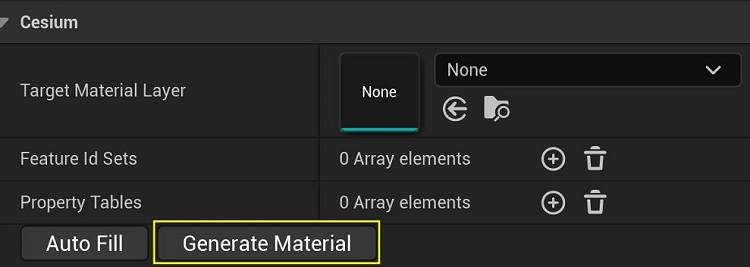

**Generate Material** creates all of the nodes necessary for retrieving feature IDs and metadata in the **Target Material Layer**. This includes the required parameters, custom function nodes, and other "boilerplate" code that can be confusing to set up. The **Target Material Layer** can point to an existing asset so that it receives the generated nodes. If **Target Material Layer** is left empty, a new material layer asset will be created instead.

Feature ID sets and metadata properties have specific naming schemes for their corresponding material parameters, which **Generate Material** will handle. All nodes generated by this function will have an `"AUTOGENERATED DO NOT EDIT"` message in their node descriptions. **Modifying these autogenerated nodes in any way is discouraged.** Otherwise, feature IDs and metadata values may not be properly retrieved by the material layer.

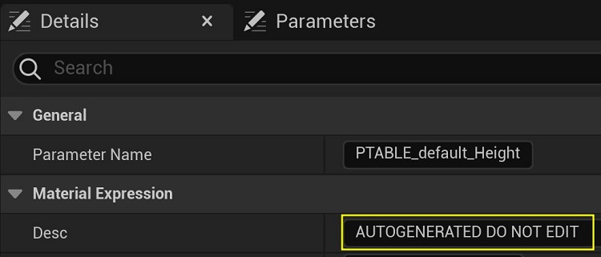

Once the material layer has been generated, it can be added to a material instance with the **"FeaturesMetadata"** label.

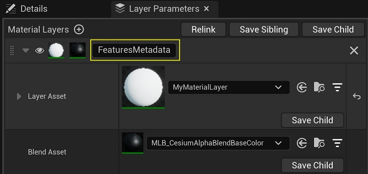

> Previous versions of Cesium for Unreal required the "Metadata" label in the material instance. This label is reserved for backwards compatibility with `UCesiumEncodedMetadataComponent`. However, it will not work for the newer `UCesiumFeaturesMetadataComponent`. **Use the "FeaturesMetadata" label**, or else the feature IDs and metadata will not be passed to the material layer.

### Feature ID Sets

Cesium for Unreal v2.0 supports styling with all types of feature ID sets – attribute, texture, and implicit. Feature ID sets can now be passed to materials without requiring an association with property tables. This reflects how `EXT_mesh_features` can exist independently of the `EXT_structural_metadata` extension in a glTF.

`UCesiumFeaturesMetadataComponent` will distinguish feature ID sets across the same tileset by type and name. This name attempts to use the `label` of the feature ID set in the `EXT_mesh_features` extension. If `label` is not defined, a name will be automatically generated for the feature ID set based on its type. Additionally, a feature ID set can specify if it is associated with a property table from the model's `EXT_structural_metadata`.

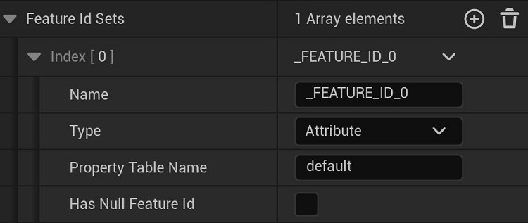

> **Note**: This implementation assumes that feature ID sets with the same name will have identical definitions throughout the tileset. If a feature ID set is defined differently between two glTF primitives, it may lead to undefined behavior.
>
> For example, suppose that one primitive's `EXT_mesh_features` contains a feature ID attribute named **"FeatureIDSet0"**. Theoretically, another primitive in the tileset can also contain a **"FeatureIdSet0"**, but defined instead as a feature ID texture. If the feature ID attribute is discovered first, the `UCesiumFeaturesMetadataComponent` assumes that all subsequent instances of **"FeatureIdSet0"** are also attributes. This will result in unexpected behavior when it tries to handle **"FeatureIdSet0"** in the second primitive.

In general, the list of feature ID sets populated by **Auto Fill** may be larger than the list of feature ID sets that a glTF primitive actually has. All feature ID sets can be simultaneously handled in the Unreal material layer, but they may have nonexistent values depending on the primitive.

Below are examples of the nodes added by **Generate Material** for each type of feature ID set.

| Type      | Example                                                                   |
| --------- | ------------------------------------------------------------------------- |
| Attribute |  |
| Texture   | 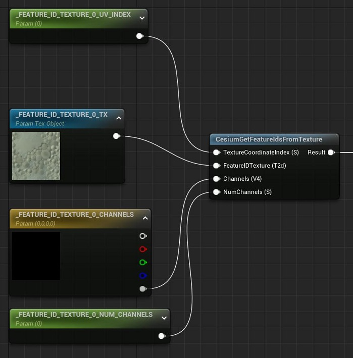   |
| Implicit  | 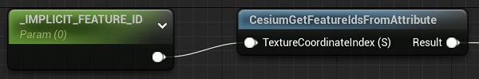  |

> Implicit feature IDs are passed as an attribute to the material because there is no way (currently) to retrieve the vertex index with a material node.

**Auto Fill** can also detect whether a feature ID set contains a `nullFeatureId` in the `EXT_mesh_features` extension. If so, it will tick the **Has Null Feature Id** checkbox, allowing the `nullFeatureId` to be passed to the material layer as a parameter. An **If** node will also be added to the material to allow feature IDs to be compared against the null value.

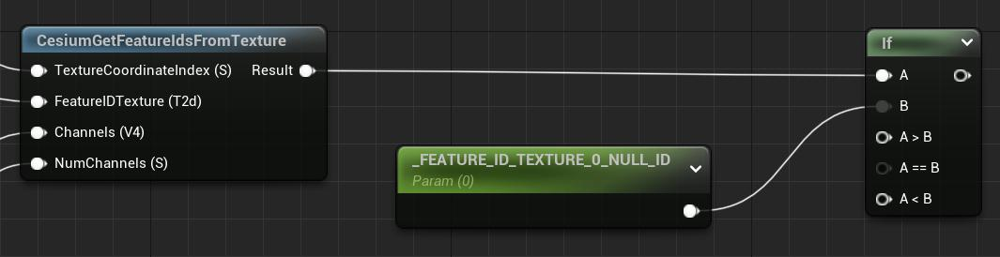

The null feature ID provides a way to specify fallback behavior for "feature-less" vertices, i.e., vertices whose feature IDs are equal to the null feature ID value. This can help avoid visual errors when attempting to access property table values with the null feature ID.

### Property Tables

Feature ID sets are often used in combination with property tables in `EXT_structural_metadata`, specifying how the metadata values apply per-feature. In Cesium for Unreal v2.0, property tables can be used both with or without feature ID sets for styling. It is also possible to sample the same property table using multiple feature ID sets, with performance implications in mind.

`UCesiumFeaturesMetadataComponent` will distinguish property tables across the same tileset by their name. This comes directly from their `name` in the `EXT_structural_metadata` extension. If a property table has no `name`, it will substitute its `class` as its name instead. For example, an unnamed property table providing data for the `buildings` class will appear as "`buildings`" in its description.


Each property table description contains a list of properties that are also distinguished their names. **Auto Fill** will find all of the properties belonging to this property table name across the tileset. Remember to **delete any and all unused properties** to avoid unnecessary metadata encoding.


> **Note**: Within a tileset, it is possible for property tables from different models to have different schemas, despite sharing the same name or class. This is especially true if the glTFs were upgraded from the legacy `b3dm` (Batched 3D Model) format. As such, not all properties listed under the description are necessarily present in every individual model.
>
> If a property is listed in the description but missing from a model's property table, it will fall back on default values. For example, if a scalar property is missing from a model, its texture will be encoded with all zeroes.

Every property table property displays **Property Details** that capture detailed information about the property's type. This also includes any special characteristics about the property, e.g., if it is `normalized` or has an `offset` and `scale`. This information is taken from its corresponding `classProperty` definition in `EXT_structural_metadata`, but the `offset` and `scale` may be defined on individual instances of the property. **Auto Fill** will detect these instance definitions as it is gathering the other information.

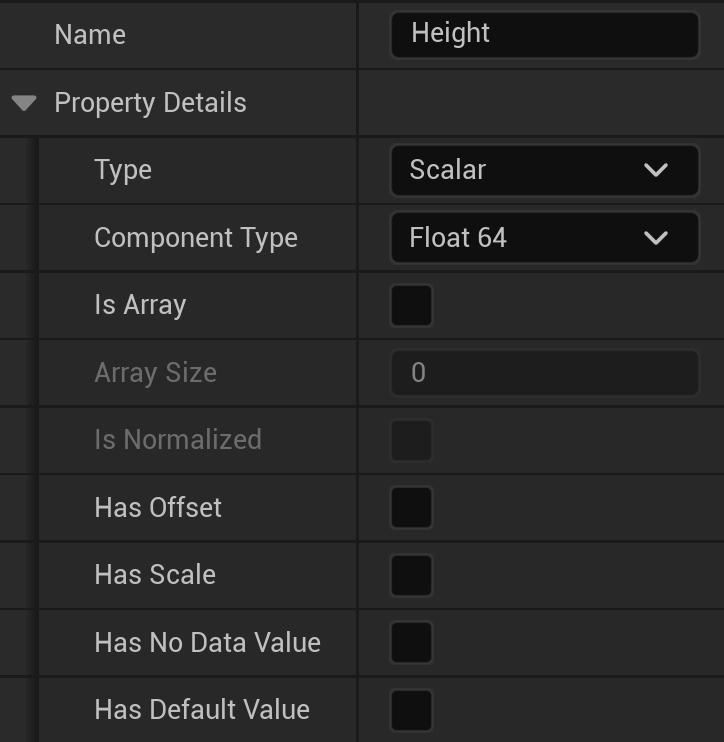

> **Note**: This implementation assumes that same-name properties will have identical definitions if they are under same-name property tables In other words, the **Property Details** of the first found property are assumed to represent all other instances of that property table property throughout the tileset. If any instance of the property has different property details, they will not overwrite the existing details in the description. This may affect how its values are transferred to the Unreal material.

Below the **Property Details** are the **Encoding Details**, which determine how a property's values will be encoded to a texture and how they will be retrieved from the texture parameter.
The **Property Details** inform how a property table property can be best encoded during **Auto Fill**. However, the **Encoding Details** of the property may be manually set if desired.


Once the necessary **Property Details** and **Encoding Details** are filled out, **Generate Material** will create a custom node that retrieves the values for the listed properties. As previously described, the values for the properties will be passed in as texture parameters.

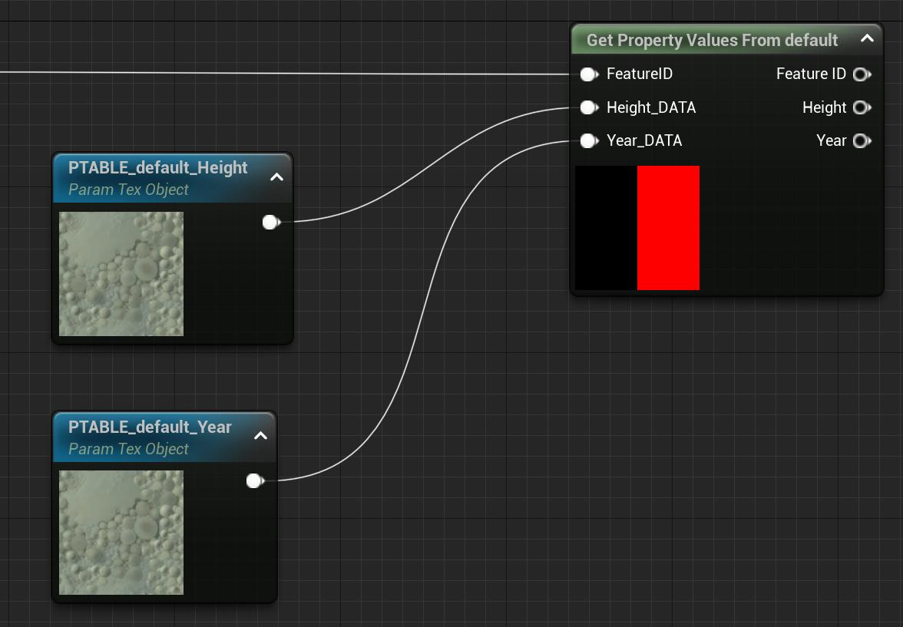

The options in **Property Details** can prompt additional nodes to be generated. For instance, if any of **Is Normalized**, **Has Offset**, or **Has Scale** are true, a custom node will be created to handle the transforms.

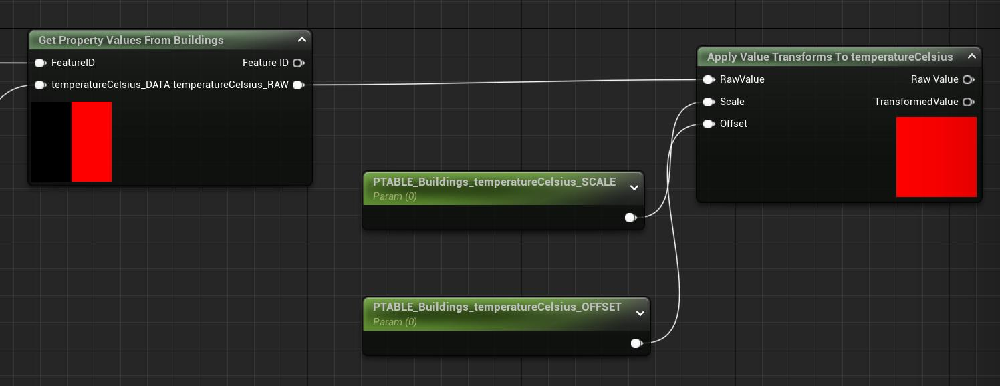

When value transforms are present in the property, the property's _raw_ values will be encoded. They can then be transformed by the body of the custom function. The `scale` and `offset` are passed to the material as parameters, and the **TransformedValue** output provides the value with normalization, scale, and offset applied.

Then, if **Has No Data Value** is true, another parameter node and an **If** node will be generated. The "no data" value acts as a sentinel value, indicating when a feature has no associated data for that property. This **If** node enables fallback behavior to be executed when the "no data" value is encountered.

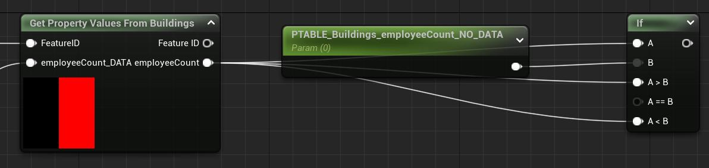

> **Note**: The "no data" value is compared against raw property values, not the transformed ones.

Finally, if **Has Default Value** is true, nodes can be autogenerated to handle the default value. It is entirely possible (and allowed by the spec) for a property to omitted from the property table, if it is not marked `required` in the `classProperty`. If the `classProperty` provides a `default` value, the default value should be used instead. **Generate Material** adds parameters and an **If** node to check for this case.

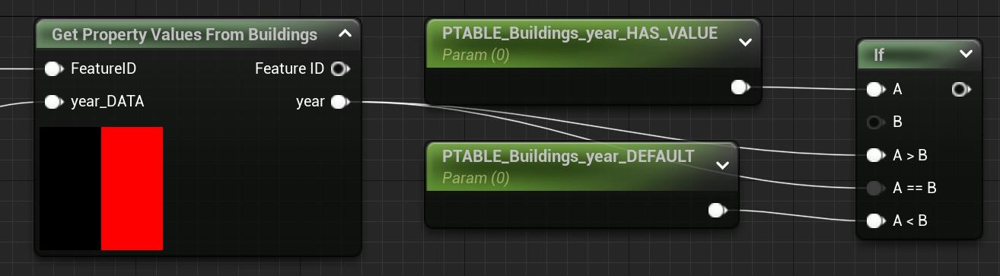

> The `B` of the **If** node is set to a constant 1.0.

If an instance of the property table property actually contains a buffer of values, they can be encoded to a texture that gets sampled in the material, as expected. However, if this property has been omitted from an instance of the property table, then only the `default` value can be used. The `HAS_VALUE` parameter acts as a boolean to indicate when this property has been omitted, and if so, to ignore the invalid texture sample in favor of the default value.

If the property has a "no data" value as well, the default value will automatically be used as a fallback when encountering the "no data" value.

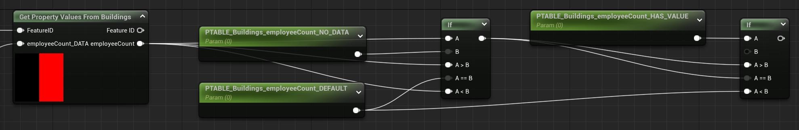

If all of **Has Offset**, **Has Scale**, **Has No Data Value**, and **Has Default Value** are simultaneously enabled on the same property, **Generate Material** will produce a material graph that contains a combination of the aforementioned nodes.

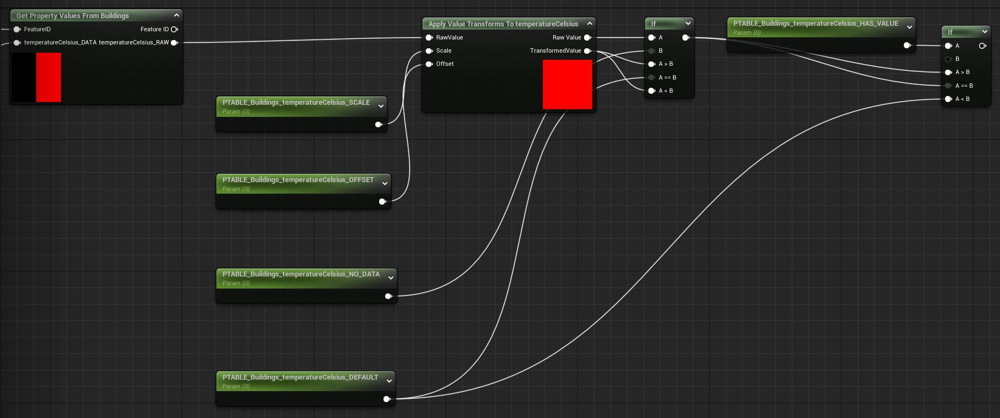

The logic of this graph can be summarized as the following pseudocode:

```
if (propertyHasValue) {
  if (rawValue == noDataValue) {
    return defaultValue;
  }

  transformedValue = rawValue * scale + offset;
  return transformedValue;

} else {
  return defaultValue;
}

```

### Supported Properties

Cesium for Unreal v2.0 only supports texture formats with up to four channels, and only with `Uint8` or `Float` components. This unfortunately limits the types of properties that can be made accessible to the material. Still, it is possible to configure the property's **Conversion** method to manipulates the values into a texture-compatible format. The built-in conversion methods include **Coerce** – converting to a numeric value that fits in the specified **Component Type** – and **Parse Color From String** – attemping to parse hexcode or RGB colors from a string property. Additional conversions can be implemented in C++ by following the structure of the other two methods.

Unfortunately, these conversion methods are not compatible with all property types, and such types are explicitly unsupported. The following property types cannot be encoded or accessed in Unreal materials:

- Enums
- Strings that cannot be parsed as numbers or colors
- Matrices
- Variable-length arrays
- Arrays of non-scalar and non-boolean elements

Additionally, if a property contains arrays of fixed length, only up to the first four elements will be encoded.
